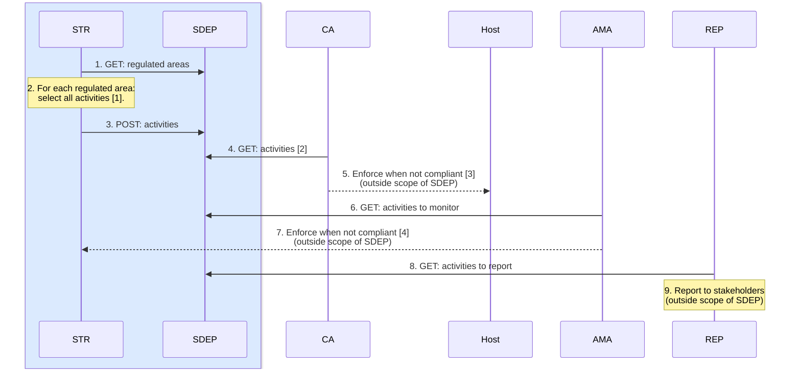

<h1>Activity</h1>

This document provides an overview of SDEP activities.

Status: implemented.

<h2>Table of Contents</h2>

- [Goal](#goal)
- [Sequence](#sequence)
- [Data](#data)
- [Implementation](#implementation)
- [Process](#process)

## Goal

To support short-term rental **activity regulation**.

## Sequence

---

Legend:

- **STR** - Short-Term Rental Platform
- **SDEP** - Single Digital Entrypoint
- **CA** - Competent Authority
- **Host** - Short-Term Rental Host
- **AMA** - Activity Monitoring Authority
- **REP** - Reporting and Statistics
- Blue is EU-harmonized, the rest is country-specific
- All actions happen periodically/asynchronously

Footnotes:

- 2.[1] Activities with addresses located within the regulated area area.
- 4.[2] Activities with addresses located within a regulated area for which the CA is responsible.
- 5.[3] For example: when hosts exceed an established activity maximum.
- 7.[4] For example: when the number of posted activities is insufficient.

---

Remarks:

- Process implementations for compliance, monitoring, and reporting are outside the scope of SDEP.

## Data

See:

- [External API](https://sdep.gov.nl/api/docs)
- [Internal data model](./DATAMODEL.md)

## Implementation

To be done:

- Keycloak role `sdep_ama` plus `Role` enum entry (`Role` currently has CA, STR, REP, READ, WRITE)
- Domain sub-app `/api/ama/v1` in `API_DOMAINS` (currently AUTH, CA v1/v2, STR, REP), implementing action 6 with the same read handler and filters as REP v1 (`createdAtFrom`, `createdAtTo`, `areaId`, `platformId`, `competentAuthorityId`)
- Referential integrity: the bulk RI check verifies that `areaId` exists but ignores `Area.regulation`, so an activity against a `listing`-only area is accepted today; add `regulation` in (`activity`, `all`), shared with the [listings](./LISTING.md#validation) check >> to be checked (v2)

## Process

Activities are [versioned](./ARCHITECTURE_TECH.md#versioning).

As discussed in the EU technical working group:

- Activity data should only be sent by STR platforms after the stay completion.
- Use the check-out date as the determining factor for which reporting period an activity record belongs to.

Example:

- A stay running from 28 March to 2 April has a check-out date of 2 April
- It falls in the April reporting period and is submitted in the May submission cycle

Rationale:

- This is the most natural and operationally clean rule for platforms
- A stay is only "complete" at check-out, and the data (including duration and guest count) is only fully known at that point
- It also avoids the complexity of splitting multi-month stays across periods

See also https://github.com/SEMICeu/sdep/issues/40.
