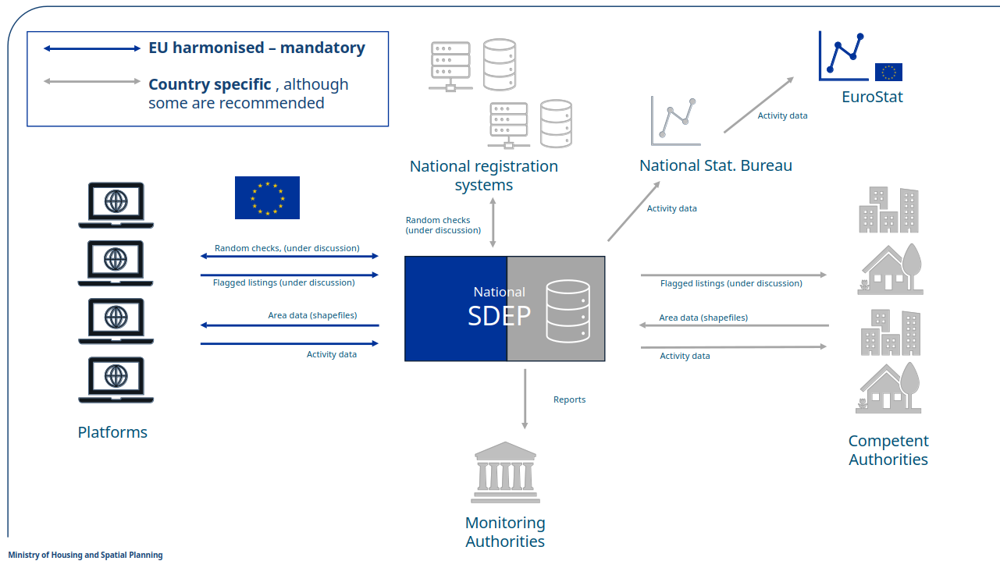

<h1>Functional Architecture</h1>

This document provides an overview of the SDEP (Single Digital Entry Point) functional architecture:

- [Diagram](#diagram)
- [Proces](#proces)
  - [Update of shapefiles](#update-of-shapefiles)
  - [Send activity data](#send-activity-data)

## Diagram

Arrows indicate information flows:

## Proces

### Update of shapefiles

Update of shapefiles at the beginning of each month.

As discussed in the technical working group: this logic is not handled by the SDEP, but by agreement on a process.

For example, a new Competent Authority want to regulate their area.

- The regulation should start at the beginning of a month
- And the platforms should be informed 'timely' about the new regulation for that area

See also https://github.com/SEMICeu/sdep/issues/22.

### Send activity data

The activity data should only be sent by STR platforms after the stay completion.

As discussed in the technical working group: use the check-out date as the determining factor for which reporting period an activity record belongs to.

Example:

- A stay running from 28 March to 2 April has a check-out date of 2 April
- It falls in the April reporting period and is submitted in the May submission cycle

Rationale:

- This is the most natural and operationally clean rule for platforms
- A stay is only "complete" at check-out, and the data (including duration and guest count) is only fully known at that point
- It also avoids the complexity of splitting multi-month stays across periods

See also https://github.com/SEMICeu/sdep/issues/40.
