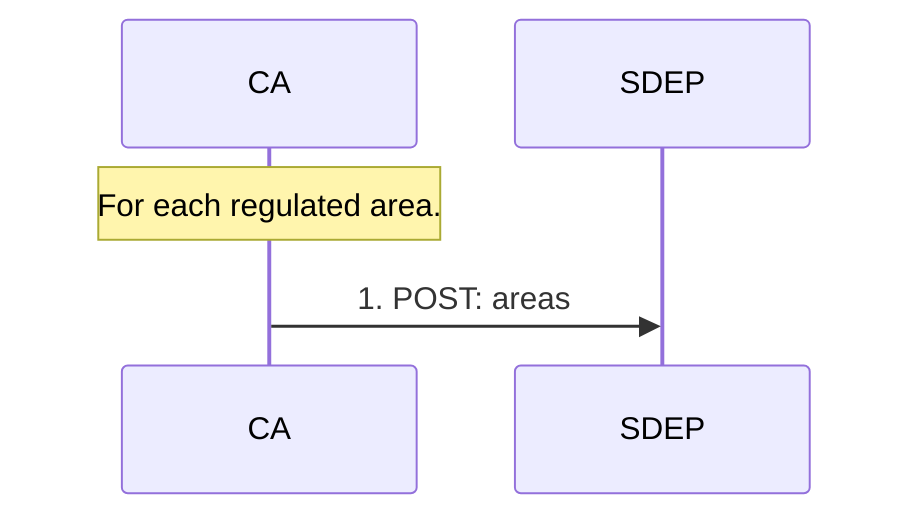

<h1>Area</h1>

This document provides an overview of SDEP areas.

Status: implemented.

<h2>Table of Contents</h2>

- [Goal](#goal)
- [Sequence](#sequence)
- [Data](#data)
- [Process](#process)

## Goal

Competent authorities (**CAs**) can opt-in for short-term rental regulation by designating one or more **regulated areas**.

## Sequence

---

Legend:

- **CA** - Competent Authority
- **SDEP** - Single Digital Entrypoint
- All actions happen periodically/asynchronously

Area management is country-specific (not EU-harmonized).

## Data

See:

- [External API](https://sdep.gov.nl/api/docs)
- [Internal data model](./DATAMODEL.md)

## Process

Areas contain shapefiles, that represent the geospatial location.

As discussed in the EU technical working group:

- It is assumed that shapefiles are updated at the beginning of each month.
- This logic is not handled by the SDEP, but by agreement on a process.

For example, a new Competent Authority wants to regulate their area.

- The regulation should start at the beginning of a month
- And the platforms should be informed 'timely' about the new regulation for that area

See also https://github.com/SEMICeu/sdep/issues/22.
