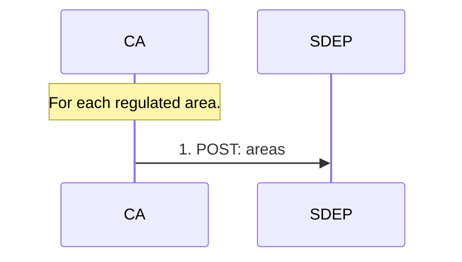

<h1>Area</h1>

This document provides an overview of SDEP areas.

Status: implemented.

Reference links:

- [Area (technical)](./AREA_TECH.md)

<h2>Table of contents</h2>

- [Goal](#goal)
- [Sequence](#sequence)
- [Data](#data)
- [Process](#process)
  - [Regulation](#regulation)
  - [Versioning](#versioning)

## Goal

Competent authorities (**CAs**) can opt-in for short-term rental regulation by designating one or more **regulated areas**.

## Sequence

---

Legend:

- **CA** - Competent Authority
- **SDEP** - Single Digital Entry Point
- All actions happen periodically/asynchronously

Area management is country-specific (not EU-harmonized).

## Data

See:

- [External API](https://sdep.gov.nl/api/docs)
- [Internal data model](./DATAMODEL_TECH.md)

## Process

### Regulation

An area carries a `regulation` attribute, which says **what** the area is regulated for:

| Value      | The area accepts                                 |
| ---------- | ------------------------------------------------ |
| `listing`  | Listings (random checks) only                    |
| `activity` | Rental activities only                           |
| `all`      | Both (the default when the CA supplies no value) |

This is the switch between the two subject areas:

- A listing for an area that is regulated for activities only is rejected per item, see [Listing](./LISTING_FUNC.md)
- An activity for an area that is regulated for listings only is rejected per item (STR `v2` and up), see [Activity](./ACTIVITY_FUNC.md)

It also lets two competent authorities designate the same geographic area for different
purposes: one for listings, the other for activities.

---

### Versioning

Areas contain shapefiles, that represent the geospatial location.

Areas are [versioned](./ARCHITECTURE_TECH.md#versioning).

As discussed in the EU technical working group:

- It is assumed that shapefiles are updated at the beginning of each month.
- This logic is not handled by the SDEP, but by agreement on a process.

For example, a new Competent Authority wants to regulate their area.

- The regulation should start at the beginning of a month
- And the platforms should be informed 'timely' about the new regulation for that area

See also https://github.com/SEMICeu/sdep/issues/22.
