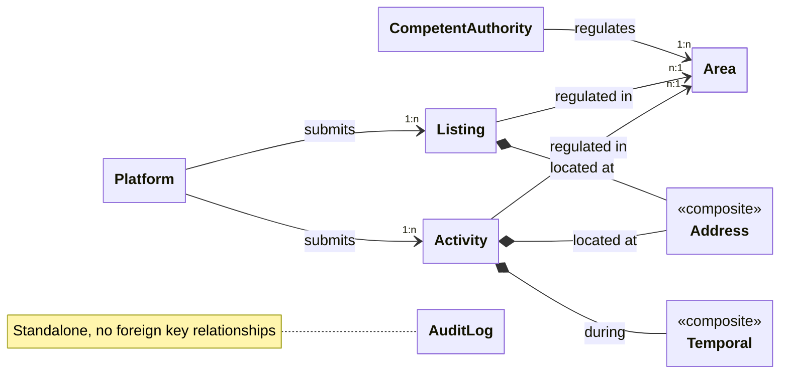

<h1>Internal data model</h1>

This page explains the SDEP **internal data model** (implementation).

**API clients** should ONLY look at the [**external data model**](https://sdep.gov.nl/api/docs) (OpenAPI spec).

<h2>Table of contents</h2>

- [Overview](#overview)
- [Classes](#classes)
  - [Competent authority](#competent-authority)
  - [Platform](#platform)
  - [Area](#area)
  - [Listing](#listing)
  - [Activity](#activity)
- [Composites](#composites)
  - [Address](#address)
  - [Temporal](#temporal)
- [AuditLog](#auditlog)

## Overview

---

- A **CompetentAuthority** regulates geographical [**Areas**](./AREA_FUNC.md) (typically one)
- A **Platform** submits randomly selected [**Listings**](./LISTING_FUNC.md) as random checks
  - A **Listing** is located at an **Address** (rental location) and is regulated in an **Area**
- A **Platform** submits rental [**Activities**](./ACTIVITY_FUNC.md) (subject to regulation)
  - An **Activity** is located at an **Address** (rental location) and is regulated in an **Area**
  - An **Activity** happens during a **Temporal** (rental time period)
- Listings and Activities are routed to CompetentAuthorities based on the referenced Area

---

Standard attribute pattern

- Technical id (`id`)
- Functional id (`<class name>Id`)
- Display name (`<class name>Name`)
- ... (other attributes)
- Creation timestamp (`createdAt`)
- Ended-at timestamp (`endedAt`) (soft-delete)

This pattern is used to implement [versioning](./ARCHITECTURE_TECH.md#versioning).

## Classes

The datamodel is a logical datamodel:

- References are expressed as objects instead of foreign keys
- References are implemented by foreign keys to technical ids

---

### Competent authority

**Purpose:** Regulates short-term rental in geographic areas

| Attribute                  | Type      | Constraints                                                                       |
| :------------------------- | :-------- | :-------------------------------------------------------------------------------- |
| **id**                     | int       | required, is technical id                                                         |
| **competentAuthorityId**   | string    | required, is functional id, UUIDv4 RFC 9562, always auto-generated, length \<= 64 |
| **competentAuthorityName** | string    | optional, length \<= 64, e.g. "Gemeente Amsterdam"                                |
| **clientId**               | string    | required, name-based reference to `client_id` in JWT claim, length \<= 64         |
| **areas**                  | reference | optional, references many Area, restricted delete                                 |
| **createdAt**              | datetime  | required, UTC, managed by SDEP                                                    |
| **endedAt**                | datetime  | optional, UTC, managed by SDEP                                                    |

**Class Constraints:**

- UNIQUE (`competentAuthorityId`, `clientId`, `createdAt`) = functional id, owner, version timestamp
- UNIQUE current (`clientId`) where `endedAt` is `null` = one active competent authority per auth client

**Clarifications:**

- The `competentAuthorityId` is a functional identifier
  - May be exposed in API responses
- `clientId` represents a private authentication identifier
  - Must not be exposed in API responses
- A `competentAuthorityId` is always generated by SDEP (UUIDv4), one per client (`clientId`)
  - A new version (e.g. after a changed `client_name`) keeps the `competentAuthorityId`
- A competent authority can submit multiple areas
  - In practice, it is expected that most competent authorities will typically submit only one area

---

### Platform

**Purpose:** Delivers randomly selected listings (random checks) and rental activities to competent authorities

| Attribute        | Type      | Constraints                                                                       |
| :--------------- | :-------- | :-------------------------------------------------------------------------------- |
| **id**           | int       | required, is technical id                                                         |
| **platformId**   | string    | required, is functional id, UUIDv4 RFC 9562, always auto-generated, length \<= 64 |
| **platformName** | string    | optional, length \<= 64, e.g. "Example platform"                                  |
| **clientId**     | string    | required, name-based reference to `client_id` in JWT claim, length \<= 64         |
| **listings**     | reference | optional, references many Listing, restricted delete                              |
| **activities**   | reference | optional, references many Activity, restricted delete                             |
| **createdAt**    | datetime  | required, UTC, managed by SDEP                                                    |
| **endedAt**      | datetime  | optional, UTC, managed by SDEP                                                    |

**Class Constraints:**

- UNIQUE (`platformId`, `clientId`, `createdAt`) = functional id, owner, version timestamp
- UNIQUE current (`clientId`) where `endedAt` is `null` = one active platform per auth client

**Clarifications:**

- The `platformId` is a functional identifier
  - May be exposed in API responses
- `clientId` represents a private authentication identifier
  - Must not be exposed in API responses
- A `platformId` is always generated by SDEP (UUIDv4), one per client (`clientId`)
  - A new version (e.g. after a changed `client_name`) keeps the `platformId`
- A platform can submit multiple listings
- A platform can submit multiple activities

---

### Area

**Purpose:** Defines a geographic region for short-term rental regulation

| Attribute              | Type        | Constraints                                                                                                                     |
| :--------------------- | :---------- | :------------------------------------------------------------------------------------------------------------------------------ |
| **id**                 | int         | required, is technical id                                                                                                       |
| **areaId**             | string      | required, is functional id, length \<= 64, alphanumeric with hyphens, is supplied or auto-generated otherwise (UUIDv4 RFC 9562) |
| **areaName**           | string      | optional, length \<= 64, e.g. "Amsterdam-Noord"                                                                                 |
| **regulation**         | enum        | required, one of {'listing', 'activity', 'all'}, defaults to 'all' when not supplied                                            |
| **competentAuthority** | reference   | required, references single Competent Authority (owner)                                                                         |
| **filename**           | string      | required, length \<= 64, e.g. "Amsterdam.zip"                                                                                   |
| **filedata**           | largeBinary | required, max size 1MiB, e.g. a .zip with a collection of ESRI shapefile files                                                  |
| **listings**           | reference   | optional, references many Listing, restricted delete                                                                            |
| **activities**         | reference   | optional, references many Activity, restricted delete                                                                           |
| **createdAt**          | datetime    | required, UTC, managed by SDEP                                                                                                  |
| **endedAt**            | datetime    | optional, UTC, managed by SDEP                                                                                                  |

**Class Constraints:**

- UNIQUE (`areaId`, `competentAuthority`, `createdAt`) = functional id, owner, version timestamp
- UNIQUE current (`areaId`, `competentAuthority`) where `endedAt` is `null` = one active area version per competent authority
- CHECK (`areaId` matches `^[A-Za-z0-9-]+$`)

**Clarifications:**

- The `areaId` is a functional identifier
  - May be exposed in API responses
- An `areaId` is unique only within the scope of a competent authority, and within the context of a specific version (`createdAt`)
  - This allows different competent authorities to use the same `areaId` independently
  - This enables competent authorities to submit versioned updates over time
- Per EU STR Regulation Article 13, there are two types of areas:
  - (1) areas where the registration procedure applies ("listing"), which require platforms to perform random checks and enforce registration numbers on host listings, and
  - (2) areas for which competent authorities have requested activity data ("activity"), which require platforms to forward activity data to the SDEP
  - Depending on Member State context, these areas may not overlap and the authority for defining them may not be the same entity
  - The `regulation` attribute allows the same Area to be supplied for all use cases: one CA for both purposes ("all"), or multiple CAs supplying the same geographic area for different purposes ("listing" or "activity")
- For an area, multiple listings will be submitted (listing regulation)
- For an area, multiple activities will be submitted (activity regulation)

---

### Listing

**Purpose:** Represents a randomly selected listing submitted by a platform for screening (random check), see [Listing](./LISTING_FUNC.md)

| Attribute                     | Type            | Constraints                                                                                                                     |
| :---------------------------- | :-------------- | :------------------------------------------------------------------------------------------------------------------------------ |
| **id**                        | int             | required, is technical id                                                                                                       |
| **listingId**                 | string          | required, is functional id, length \<= 64, alphanumeric with hyphens, is supplied or auto-generated otherwise (UUIDv4 RFC 9562) |
| **listingName**               | string          | optional, length \<= 64, e.g. "Amsterdam Canal Apartment"                                                                       |
| **status**                    | enum            | required, lifecycle status; `pending` (default), `clear`, `flagged`, `acknowledged`                                             |
| **platform**                  | reference       | required, references single Platform                                                                                            |
| **area**                      | reference       | required, references single Area                                                                                                |
| **url**                       | string          | required, length \<= 2048, references the listing online                                                                        |
| **address**                   | reference       | required, references single Address as composite                                                                                |
| **declaredAsShortTermRental** | bool            | required, host self-declaration                                                                                                 |
| **registrationNumber**        | string          | optional, length \<= 32                                                                                                         |
| **flags**                     | array of string | required, may be empty; each a [flag code](./LISTING_TECH.md#listingresponse) (`ABS`, `UNK`, `EXP`, `MIS`, `NPR`, `UNX`, `UDS`) |
| **submittedAt**               | datetime        | required, UTC; set by the platform's submission, copied forward otherwise                                                       |
| **screenedAt**                | datetime        | optional, UTC; set by the screening, copied forward otherwise                                                                   |
| **acknowledgedAt**            | datetime        | optional, UTC; set by the acknowledgement                                                                                       |
| **createdAt**                 | datetime        | required, UTC, managed by SDEP                                                                                                  |
| **endedAt**                   | datetime        | optional, UTC, managed by SDEP                                                                                                  |

**Class Constraints:**

- UNIQUE (`listingId`, `platform`, `createdAt`) = functional id, owner, version timestamp
- UNIQUE current (`listingId`, `platform`) where `endedAt` is `null` = one active listing version per platform
- INDEX current (`createdAt`, `id`) where `endedAt` is `null` = the reads page through current rows, newest first
- CHECK (`listingId` matches `^[A-Za-z0-9-]+$`)
- CHECK (`status` in (`flagged`, `acknowledged`) ⇒ `flags` non-empty; `status` in (`pending`, `clear`) ⇒ `flags` empty)

**Clarifications:**

- A `listingId` is unique only within the scope of a platform, and within the context of a specific version (`createdAt`), as `activityId`
- Every transition creates a new version; no listing row is updated in place
  - The platform corrects a `pending` listing by resubmitting the same `listingId`
  - The listing screening authority sets `clear` or `flagged` (and may re-screen); the platform acknowledges a `flagged` listing (final)
- `createdAt` is the version timestamp and doubles as the concurrency token for screening and acknowledgement
- Each listing must reference an existing area that is regulated for listings (`regulation` is `listing` or `all`)

---

### Activity

**Purpose:** Represents an actual rental activity submitted by a platform

| Attribute              | Type            | Constraints                                                                                                                     |
| :--------------------- | :-------------- | :------------------------------------------------------------------------------------------------------------------------------ |
| **id**                 | int             | required, is technical id                                                                                                       |
| **activityId**         | string          | required, is functional id, length \<= 64, alphanumeric with hyphens, is supplied or auto-generated otherwise (UUIDv4 RFC 9562) |
| **activityName**       | string          | optional, length \<= 64, e.g. "Summer rental"                                                                                   |
| **status**             | string          | required, lifecycle status; `finished` by default when omitted, or `cancelled`                                                  |
| **platform**           | reference       | required, references single Platform                                                                                            |
| **area**               | reference       | required, references single Area                                                                                                |
| **url**                | string          | required, length \<= 2048, e.g. http://example.com/my-advertisement                                                             |
| **address**            | reference       | required, references single Address as composite                                                                                |
| **registrationNumber** | string          | required, length \<= 32                                                                                                         |
| **numberOfGuests**     | int             | required, min 1, max 1024                                                                                                       |
| **countryOfGuests**    | array of string | required, min 1, max 1024; each ISO 3166-1 alpha-3 or `N/A`                                                                     |
| **temporal**           | reference       | required, references single Temporal as composite                                                                               |
| **createdAt**          | datetime        | required, UTC, managed by SDEP                                                                                                  |
| **endedAt**            | datetime        | optional, UTC, managed by SDEP                                                                                                  |

**Class Constraints:**

- UNIQUE (`activityId`, `platform`, `createdAt`) = functional id, owner, version timestamp
- UNIQUE current (`activityId`, `platform`) where `endedAt` is `null` = one active activity version per platform
- INDEX current (`createdAt`, `id`) where `endedAt` is `null` = the reads page through current rows, newest first
- CHECK (`activityId` matches `^[A-Za-z0-9-]+$`)
- The `numberOfGuests` must equal the number elements in `countryOfGuests`

**Clarifications:**

- The `activityId` is a functional identifier
  - May be exposed in API responses
- An `activityId` is unique only within the scope of a platform, and within the context of a specific version (`createdAt`)
  - This allows different platforms to use the same `activityId` independently
  - This enables platforms to submit versioned updates over time
- A later version may change `status` from `finished` to `cancelled`
  - This allows STRs to make corrections
  - Vice versa is (yet) also allowed
- Each activity must reference an existing area that is regulated for activities
- For `url`, max length is 2048: a chosen pragmatic cap, not a browser limit
  - The often-quoted 2048 traces back to Internet Explorer, which capped the path at 2048 and the full URL at 2083 characters
  - Current browsers accept far longer URLs and [RFC 9110, section 4.1](https://www.rfc-editor.org/rfc/rfc9110#section-4.1) asks for support of at least 8000 octets.
  - STR v1 keeps its stable limit of 128 on input; from v2 on, input allows 2048.

## Composites

### Address

**Purpose:** Structured address information for rental activities (INSPIRE/STR-AP format)

| Attribute                     | Type   | Constraints                                                         |
| :---------------------------- | :----- | :------------------------------------------------------------------ |
| **thoroughfare**              | string | required, length \<= 80, e.g. "Turfmarkt"                           |
| **locatorDesignatorNumber**   | int    | optional, >= 1, e.g. 147                                            |
| **locatorDesignatorLetter**   | string | optional, length \<= 10, alphabetic, e.g. "a", "bis"                |
| **locatorDesignatorAddition** | string | optional, length \<= 128, e.g. "5h"                                 |
| **postCode**                  | string | required, length \<= 10, no spaces, alphanumeric, e.g. 2500EA       |
| **postName**                  | string | required, length \<= 80, e.g. Den Haag                              |
| **fullAddress**               | string | required, length \<= 328, e.g. "Turfmarkt 147a-5h, 2500EA Den Haag" |

**Class Constraints:**

- CHECK (`locatorDesignatorLetter` is null or alphabetic)

**Clarifications:**

- For `fullAddress`, max length is 328: the sum of the other address field maximums (318 = 80 + 10 (unsigned int 32 bit) + 10 + 128 + 10 + 80) plus 5 separators of ", " (10)
  - STR v1 keeps its stable limit of 318 on input; from v2 on, input allows 328

---

### Temporal

**Purpose:** Time period information for rental activities

| Attribute         | Type     | Constraints                    |
| :---------------- | :------- | :----------------------------- |
| **startDatetime** | datetime | required, year must be >= 2025 |
| **endDatetime**   | datetime | required                       |

**Class Constraints:**

- CHECK (startDatetime < endDatetime)
- CHECK (startDatetime year >= 2025)

## AuditLog

**Purpose:** Append-only log of API requests for compliance, security monitoring, and operational accountability

| Attribute          | Type     | Constraints                                                                                                                                                                                       |
| :----------------- | :------- | :------------------------------------------------------------------------------------------------------------------------------------------------------------------------------------------------ |
| **id**             | int      | required, is technical id                                                                                                                                                                         |
| **timestamp**      | datetime | required, UTC, server default now()                                                                                                                                                               |
| **requestId**      | string   | required, UUID4, length \<= 64                                                                                                                                                                    |
| **roles**          | string   | optional, length \<= 256; verified roles (comma-separated), or `null` when no token was authenticated (401, or unauthenticated endpoints). The 401/403 distinction is encoded in `httpStatusCode` |
| **resourceType**   | string   | optional, length \<= 32                                                                                                                                                                           |
| **action**         | string   | required, length \<= 64, semantic action name                                                                                                                                                     |
| **httpMethod**     | string   | required, length \<= 10                                                                                                                                                                           |
| **path**           | string   | required, length \<= 512                                                                                                                                                                          |
| **httpStatusCode** | int      | required                                                                                                                                                                                          |
| **statusCode**     | string   | required, length \<= 3, "OK" if < 400 else "NOK"                                                                                                                                                  |
| **durationMs**     | int      | optional                                                                                                                                                                                          |

**Clarifications:**

- Append-only: no updates or deletes (except automated retention cleanup)
- Standalone table with no foreign key relationships
- Indexes on: `timestamp`, `request_id`
- **Retention:** rows older than `AUDITLOG_RETENTION` days (default 1) are automatically deleted by a background task
