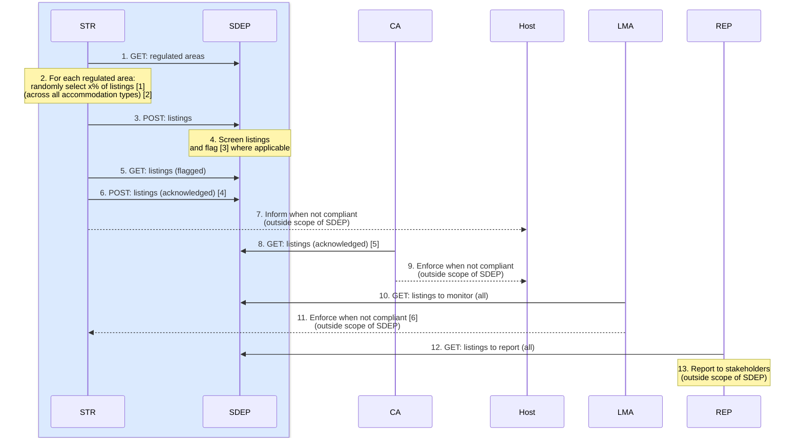
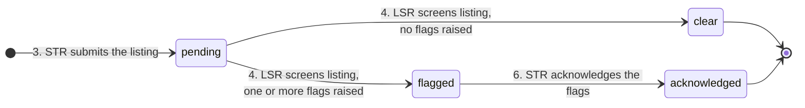

<h1>Listings</h1>

This document provides an overview of SDEP listings.

Status: PROPOSAL / DRAFT.

<h2>Table of Contents</h2>

- [Goal](#goal)
- [Sequence](#sequence)
- [States](#states)
- [Endpoints (new)](#endpoints-new)
  - [EU-harmonized](#eu-harmonized)
  - [Country-specific](#country-specific)
  - [Design Decisions](#design-decisions)
- [Data Structure](#data-structure)
  - [EU-harmonized](#eu-harmonized-1)
  - [Country-specific](#country-specific-1)
  - [Concurrency](#concurrency)
- [TravelTech](#traveltech)
- [Implementation](#implementation)
  - [Schemas](#schemas)
  - [Internal Data Model](#internal-data-model)
  - [Bulk Validation Flow](#bulk-validation-flow)
  - [Remaining Work](#remaining-work)
- [Technical Working Group](#technical-working-group)

## Goal

To support short-term rental **listing regulation**.

## Sequence



---

Legend:

- **STR** - Short-Term Rental Platform
- **SDEP** - Single Digital Entrypoint
- **CA** - Competent Authority
- **Host** - Short-Term Rental Host
- **LMA** - Listing Monitoring Authority
- **REP** - Reporting and Statistics
- Blue is EU-harmonized, the rest is country-specific
- All actions happen periodically/asynchronously

Footnotes:

- 2.[1] x% of listings = listings with addresses located within the regulated area (and repeat this for each regulated area).
- 2.[2] All accommodation types = short-term rentals, hotels, hostels, ...
- 4.[3] For example: a listing registration number and its address mismatch the corresponding record in a registration system.
- 6.[4] Assume there is no need to further enrich the data (such as agree/dispute/remark).
- 8.[5] These are the acknowledged listings with addresses located within a regulated area for which the CA is responsible.
- 11.[6] For example: when the number of randomly selected listings is insufficient.

---

Remarks:

- Process implementations for compliance, monitoring, and reporting are outside the scope of SDEP.

## States



---

Legend:

- `pending` - submitted by the platform, awaiting screening
- `clear` - screened, no flags raised
- `flagged` - screened, one or more [flag codes](#eu-harmonized-1) raised, not yet acknowledged
- `acknowledged` - the platform confirmed receipt of the flags

Remarks:

- Every transition creates a new [version](#internal-data-model) of the listing; a listing row is never updated in place.
- A resubmission with the same `listingId` (correction) is allowed in every state and restarts the lifecycle at `pending`, so the corrected data is screened again.
- A screening resubmission (LSR correction) is allowed in `pending`, `clear` and `flagged` and lands in `clear` or `flagged` according to the new flags. It is refused in `acknowledged`: the LSR cannot undo an acknowledgement.
- A resubmission with a new `listingId` (recurrence in a new random check) starts a separate lifecycle.
- Flags raised in the `flagged` state are retained after acknowledgement, so `acknowledged` does not erase the screening outcome.
- The correction edges (`* --> pending` for the platform, `clear|flagged --> clear|flagged` for the LSR) are left out of the diagram for readability.

## Endpoints (new)

Approach:

- POST follows the same logic as STR activities, incl. bulk and REST noun-based collection URLs.
- GET follows the same logic as [CA v2 activities](https://sdep.gov.nl/api/docs), incl. query filters for date/platform/area.
- The EU-harmonized API is separated from the country-specific implementation.

For motivation and other design decisions, see [below](#design-decisions).

---

### EU-harmonized

| Action | Endpoint                                   | Description                                                                   |
| ------ | ------------------------------------------ | ----------------------------------------------------------------------------- |
| 3.     | `str: POST /listings/bulk`                 | A platform submits a batch of randomly selected listings.                     |
| 5.     | `str: GET /listings`                       | A platform retrieves its listings that have been flagged by SDEP.             |
| 5.     | `str: GET /listings/count`                 | Count, to support pagination (as for activities).                             |
| 6.     | `str: POST /listing-acknowledgements/bulk` | A platform acknowledges a batch of flagged listings (random check performed). |

---

**Filters for `str: GET /listings`**

Proposal A. (implement): a **fixed `flagged` scope, no `filterStatus`**.

- The STR router does not declare `filterStatus`; the handler receives a fixed `status_scope=flagged`, the same way it receives the client scope
- The endpoint description states "returns flagged listings only"; the OpenAPI specification is honest
- Declared filters: `filterCreatedAtFrom`, `filterCreatedAtTo`, `filterAreaId`
- Adding `filterStatus` later is backward compatible

Alternative B. (agree not to implement): **full `filterStatus`** (`pending`, `clear`, `flagged`, `acknowledged`; optional, default all).

- Most straightforward from an API perspective: one read shape for every audience
- Nothing in any state is secret from the platform: it submitted the data, `pending`/`clear` carry no new information, and the flags are exactly what action 5 delivers
- Lets a platform reconcile its own submissions and acknowledgements
- Not chosen for now, to keep the EU-harmonized surface minimal

Alternative C. (rejected): **restricted enum** (`filterStatus` declared with a smaller enum, e.g. `flagged` and `acknowledged` only).

- Technically clean (the refusal is a type, 422 on other values, OpenAPI lists only the allowed values)
- Rejected because it introduces a second status enum for one audience without a need; if the platform must see `acknowledged`, the full filter is the simpler step

`filterFlags` is not declared for STR in any variant: the flags are in the response body anyway, and the EU-harmonized surface stays minimal.

---

### Country-specific

---

**LSR**

*This is an internal implementation component.*

Country-specific (SDEP-NL/reference): a listing screener (LSR) component that implements action 4.

| Action | Endpoint                             | Description                                                                                |
| ------ | ------------------------------------ | ------------------------------------------------------------------------------------------ |
| 4.     | `lsr: GET /listings`                 | A Listing Screener (LSR) retrieves submitted listings for review (`filterStatus=pending`). |
| 4.     | `lsr: GET /listings/count`           | Count, to support pagination.                                                              |
| 4.     | `lsr: POST /listing-screenings/bulk` | A Listing Screener (LSR) submits a batch of screening results (zero or more flags each).   |

Declared filters: `filterStatus`, `filterFlags`, `filterCreatedAtFrom`, `filterCreatedAtTo`, `filterAreaId`, `filterPlatformId`.

The LSR implementation can be:

- **SDEP itself** (querying the `lsr` endpoints, calling external systems and feeding the results back into the `lsr` endpoints); or
- **An external system** (querying and feeding the `lsr` endpoints).

In either way, the implementation stays in SDEP.

- This ensures that the data point between platforms and SDEP remains the listing/registration number.
- Which conforms the [EU Traveltech position paper](#traveltech).

---

**CA**

Competent authority (country-specific, SDEP-NL/reference):

| Action | Endpoint                  | Description                                                                                                              |
| ------ | ------------------------- | ------------------------------------------------------------------------------------------------------------------------ |
| 8.     | `ca: GET /listings`       | A competent authority gets the acknowledged listings in its areas (`filterStatus=acknowledged`) for enforcing the hosts. |
| 8.     | `ca: GET /listings/count` | Count, to support pagination.                                                                                            |

Declared filters: `filterStatus`, `filterFlags`, `filterCreatedAtFrom`, `filterCreatedAtTo`, `filterAreaId`, `filterPlatformId`.

---

**LMA**

Listing monitoring authority (country-specific, SDEP-NL/reference):

| Action | Endpoint                   | Description                                                               |
| ------ | -------------------------- | ------------------------------------------------------------------------- |
| 10.    | `lma: GET /listings`       | A listing monitoring authority gets all listings for monitoring purposes. |
| 10.    | `lma: GET /listings/count` | Count, to support pagination.                                             |

Declared filters: `filterStatus`, `filterFlags`, `filterCreatedAtFrom`, `filterCreatedAtTo`, `filterAreaId`, `filterPlatformId`, `filterCompetentAuthorityId`.

*Will be implemented as second step.*

---

**REP**

Reporting and statistics office (country-specific, SDEP-NL/reference):

| Action | Endpoint                   | Description                                                                 |
| ------ | -------------------------- | --------------------------------------------------------------------------- |
| 12.    | `rep: GET /listings`       | A reporting and statistics office gets all listings for reporting purposes. |
| 12.    | `rep: GET /listings/count` | Count, to support pagination.                                               |

Declared filters: `filterStatus`, `filterFlags`, `filterCreatedAtFrom`, `filterCreatedAtTo`, `filterAreaId`, `filterPlatformId`, `filterCompetentAuthorityId`.

*Will be implemented as second step.*

---

### Design Decisions

The listing is **one resource with a lifecycle**; the writes are the **transitions** of the [state diagram](#states).

| Principle                            | Decision                                                                                                                                                                    |
| ------------------------------------ | --------------------------------------------------------------------------------------------------------------------------------------------------------------------------- |
| One resource, one URI                | All audiences read `GET /listings`. A listing never changes URI as it moves through states; the state is a filter (`filterStatus`) or a fixed server-side scope.            |
| Transitions are write collections    | `POST /listings/bulk` enters `pending`, `POST /listing-screenings/bulk` is `pending -> clear\|flagged`, `POST /listing-acknowledgements/bulk` is `flagged -> acknowledged`. |
| Name what the caller submits         | `listing-screenings` and `listing-acknowledgements` name the record the caller sends (a screening result, an acknowledgement), not the resulting state of the listing.      |
| No state in the URI                  | `/flagged-listings`, `/acknowledged-listings` are rejected: the same `listingId` would migrate between collections and be served under several URIs.                        |
| No nesting without a parent id       | `/flagged-listings/acknowledgements/bulk` is rejected: a sub-collection needs `/{id}/` in between, and three path levels for a body of `listingId` only.                    |
| Screening, not flags                 | `/listing-flags` is rejected: the `pending -> clear` transition also needs a write, and "post zero flags" is not a resource. The LSR submits a screening result.            |
| `/bulk` everywhere                   | All three writes are batch operations with per-item OK/NOK feedback, identical to `POST /activities/bulk`. Non-bulk paths stay free for single-item endpoints later.        |
| Filters follow the existing naming   | `filterStatus`, `filterFlags`, `filterCreatedAtFrom`, `filterCreatedAtTo`, `filterAreaId`, `filterPlatformId` (as CA v2 / REP v1 activities), not `?status=`.               |
| Filters are declared, not refused    | Each domain sub-app declares the query parameters it supports (as REP v1 declares `filterCompetentAuthorityId` and CA v2 does not). No runtime "refused for STR" logic.     |
| External model is not internal model | The write collections are transition commands; internally they are versions of one `Listing` class, see [Implementation](#implementation).                                  |

Consequences of "declared, not refused":

- Undeclared parameters do not appear in that sub-app's OpenAPI specification, so each audience sees an honest contract
- An invalid value for a declared parameter (unknown `filterStatus`) is a 422 from the enum type
- An undeclared parameter is silently ignored (existing behaviour for every endpoint; there is no precedent for rejecting unknown query parameters)
- The data scope is derived from the token (`client_id`), as for activities: a platform sees its own listings, a competent authority the listings in its areas, the LSR/LMA/REP all listings

## Data Structure

Schemas describe the **resource**; bulk/list schemas describe the **transport envelope**, following the Activity pattern (`Activity.Request`, `Activity.Response`, `Activity.BulkRequest`, `Activity.BulkResultItem`, `Activity.BulkResponse`, `Activity.ListResponse`, `Activity.CountResponse`). No endpoint-specific schemas.

---

### EU-harmonized

---

**`Listing.Request`**

Submitted by the platform (`POST /listings/bulk`).

| Field                       | Description                                                                                         |
| --------------------------- | --------------------------------------------------------------------------------------------------- |
| `listingId`                 | Functional ID identifying the listing (versioned = optionally supplied else auto-generated **[1]**) |
| `listingName`               | Display name (optional)                                                                             |
| `areaId`                    | Functional ID referencing the area where the listing is posted                                      |
| `url`                       | References the listing online                                                                       |
| `address`                   | Listing address (same composite as activities)                                                      |
| `declaredAsShortTermRental` | Host self-declaration (yes/no)                                                                      |
| `registrationNumber`        | Listing registration number (**optional**, unlike activities: flag code `ABS` = absent) **[2]**     |

[1] This allows the listing to be submitted as either:

- A correction (same id): allowed in every state, creates a new version in `pending`
- A recurrence in a new random check (new id)

[2] `listingId` is unique per platform (as `activityId`), not globally.

---

**`Listing.Response`**

Returned by every `GET /listings` and inside every bulk result item. The request fields, enriched with:

| Field                    | Description                                                                                         |
| ------------------------ | --------------------------------------------------------------------------------------------------- |
| `status`                 | Lifecycle status: `pending`, `clear`, `flagged`, `acknowledged`                                     |
| `flags`                  | [Flag codes](#eu-harmonized-1) raised by screening (empty until screened, non-empty when `flagged`) |
| `screenedAt`             | Timestamp of the screening (optional, UTC)                                                          |
| `acknowledgedAt`         | Timestamp of the acknowledgement (optional, UTC)                                                    |
| `areaName`               | Display name of the area (optional)                                                                 |
| `competentAuthorityId`   | Functional ID of the competent authority that owns the area                                         |
| `competentAuthorityName` | Display name of the competent authority (optional)                                                  |
| `platformId`             | Functional ID of the submitting platform                                                            |
| `platformName`           | Display name of the platform (optional)                                                             |
| `createdAt`              | Timestamp when this listing **version** was created (UTC); doubles as the version token             |

There is no separate `FlaggedListing` schema: a flagged listing is the same resource in state `flagged`, with `flags` populated.

---

**`ListingAcknowledgement.Request`**

Submitted by the platform (`POST /listing-acknowledgements/bulk`), one item per flagged listing.

| Field       | Description                                                     |
| ----------- | --------------------------------------------------------------- |
| `listingId` | The flagged listing (scoped to the authenticated platform)      |
| `createdAt` | The version being acknowledged, see [Concurrency](#concurrency) |

The acknowledgement carries no further data (see sequence footnote 6.[4]).

---

**Flag Codes**

| Code  | Synopsis (description)         | Declared as STR | Registration Number Present | Registration Number Known | Registration Number Valid | Address Matches Registration | Private Residence |
| ----- | ------------------------------ | :-------------: | :-------------------------: | :-----------------------: | :-----------------------: | :--------------------------: | :---------------: |
| `ABS` | Absent Registration Number     |       Yes       |             No              |             -             |             -             |              -               |         -         |
| `UNK` | Unknown Registration Number    |       Yes       |             Yes             |            No             |             -             |              -               |         -         |
| `EXP` | Expired Registration Number    |       Yes       |             Yes             |            Yes            |            No             |              -               |         -         |
| `MIS` | Mismatched Address             |       Yes       |             Yes             |            Yes            |            Yes            |              No              |         -         |
| `NPR` | Not a Private Residence        |       Yes       |             Yes             |            Yes            |            Yes            |             Yes              |        No         |
| `UNX` | Unexpected Registration Number |       No        |             Yes             |             -             |             -             |              -               |         -         |
| `UDC` | Undeclared Short-Term Rental   |       No        |             No              |             -             |             -             |              -               |        Yes        |

*The value "-" denotes "not applicable" (because the decision is already taken based on the other values).*

*For code UDC, the "private residence yes" is expected to be determined by matching the listing address details with a corresponding record in an external system.*

---

### Country-specific

---

**`ListingScreening.Request`**

Submitted by the LSR (`POST /listing-screenings/bulk`), one item per screened listing. The LSR does not send the listing back, only the result.

| Field        | Description                                                                                 |
| ------------ | ------------------------------------------------------------------------------------------- |
| `platformId` | The submitting platform (`listingId` is only unique within a platform)                      |
| `listingId`  | The screened listing                                                                        |
| `createdAt`  | The version that was screened, see [Concurrency](#concurrency)                              |
| `flags`      | Zero or more [flag codes](#eu-harmonized-1); empty means `clear`, non-empty means `flagged` |

---

### Concurrency

The screening window is external and asynchronous, so no database lock can cover it. A platform may correct a listing (new `pending` version) while the LSR is screening the previous version, and the LSR may re-screen while a platform is acknowledging. The flags of one version must never land on another.

Optimistic concurrency, using the version timestamp that every response already carries:

- `ListingScreening.Request` and `ListingAcknowledgement.Request` carry the `createdAt` of the version they refer to
- The server locks the current version (`SELECT ... FOR UPDATE`, as `get_current_by_activity_ids` does for activities) and compares
- Mismatch = per-item NOK with `type: conflict_error`, `loc: ["createdAt"]`; the rest of the batch proceeds and the response stays 200 with `succeeded`/`failed` counts, exactly like an unknown `areaId` today
- No retry path is needed: the corrected listing is `pending` again and appears in the LSR's next `GET /listings?filterStatus=pending` with its new data; the re-screened listing is `flagged` again and appears in the platform's next `GET /listings`

Example bulk result item:

```json
{
  "listingIndex": 3,
  "listingId": "abc-123",
  "status": "NOK",
  "errors": {
    "detail": [
      {
        "msg": "Listing 'abc-123' version '2026-09-07T08:00:00Z' is no longer current",
        "type": "conflict_error",
        "loc": ["createdAt"]
      }
    ]
  }
}
```

## TravelTech

The EU Traveltech position paper (available on request) matches the above design:

| EU Traveltech                                                                                                                                                                                                                                                                                                                                         | Design                                                                          |
| ----------------------------------------------------------------------------------------------------------------------------------------------------------------------------------------------------------------------------------------------------------------------------------------------------------------------------------------------------- | ------------------------------------------------------------------------------- |
| *Where random checks reveal incorrect host declarations on the existence or not of a registration procedure, misuse of a registration number, or invalid registration numbers, platforms must inform both the competent authorities and the host concerned without undue delay.*                                                                      | OK, see [actions 6,7,8](#sequence)                                              |
| *Article 13(1)(a) requires Member States to draw up, make available through the SDEP, and regularly update, the list of areas where a registration procedure applies.*                                                                                                                                                                                | OK, see [Areas](./AREA.md)                                                      |
| *Article 10(3)(b) further requires the SDEP to provide ‘a freely accessible and machine-readable online database or online interface’ for those checks*                                                                                                                                                                                               | OK, this is the SDEP API                                                        |
| *In our view, Article 7(1)(c) focuses solely on verifying the validity of the registration number itself. In practice, this means that the **registration number is the data point** used by platforms to perform the check, by submitting it through the functionalities made available via the SDEP and receiving confirmation as to its validity.* | OK, see [action 3](#sequence) and the [Listing](#eu-harmonized-1) datastructure |

## Implementation

---

### Schemas

Dotted titles, as the existing OpenAPI specification (`model_config = ConfigDict(title="Activity.Request")`):

```text
Listing.Request | .Response | .BulkRequest | .BulkResultItem | .BulkResponse | .ListResponse | .CountResponse
Listing.Status | Listing.Flag                                                   (enums)
ListingScreening.Request | .BulkRequest | .BulkResultItem | .BulkResponse
ListingAcknowledgement.Request | .BulkRequest | .BulkResultItem | .BulkResponse
```

- Bulk result items for screenings and acknowledgements return the resulting `Listing.Response` (the new version), so there is no `ListingScreening.Response` or `ListingAcknowledgement.Response`
- `Listing.BulkRequest.listings` uses `SkipValidation` per item, as `Activity.BulkRequest`, so one invalid item is NOK without failing the batch

---

### Internal Data Model

One new class, **`Listing`**, mirroring `Activity` (see [DATAMODEL.md](./DATAMODEL.md)). No `ListingScreening` or `ListingAcknowledgement` class.

| Attribute                              | Type               | Constraints                                                                    |
| :------------------------------------- | :----------------- | :----------------------------------------------------------------------------- |
| **id**, **listingId**, **listingName** | int / string       | standard pattern; `listingId` supplied or auto-generated (UUIDv4)              |
| **status**                             | enum               | required, `pending` (default), `clear`, `flagged`, `acknowledged`              |
| **platform**, **area**                 | reference          | required, as Activity                                                          |
| **url**, **address**                   | string / composite | required, as Activity (Address composite reused as-is)                         |
| **declaredAsShortTermRental**          | bool               | required                                                                       |
| **registrationNumber**                 | string             | **optional**, length \<= 32                                                    |
| **flags**                              | array of string    | required, may be empty; each a flag code (`StringArray`, as `countryOfGuests`) |
| **screenedAt**                         | datetime           | optional, UTC                                                                  |
| **acknowledgedAt**                     | datetime           | optional, UTC                                                                  |
| **createdAt**, **endedAt**             | datetime           | standard versioning                                                            |

Class constraints:

- UNIQUE (`listingId`, `platform`, `createdAt`) = functional id, owner, version timestamp
- CHECK (`listingId` matches `^[A-Za-z0-9-]+$`)
- CHECK (`status` in (`flagged`, `acknowledged`) ⇒ `flags` non-empty; `status` in (`pending`, `clear`) ⇒ `flags` empty)

**Every transition is a new version** (mark the current version ended, insert the new one), reusing the activity versioning machinery (`bulk_mark_as_ended` + insert under `FOR UPDATE`). No listing row is ever updated in place.

| Transition                              | Actor | Precondition (current version)                   | New version                                       |
| --------------------------------------- | ----- | ------------------------------------------------ | ------------------------------------------------- |
| `POST /listings/bulk` (new `listingId`) | STR   | none                                             | `pending`                                         |
| `POST /listings/bulk` (correction)      | STR   | any state                                        | `pending`, enrichment dropped                     |
| `POST /listing-screenings/bulk`         | LSR   | `pending`, `clear` or `flagged`; version matches | `clear` (no flags) or `flagged`, `screenedAt` set |
| `POST /listing-acknowledgements/bulk`   | STR   | `flagged`; version matches                       | `acknowledged`, `acknowledgedAt` set              |

A failed precondition is a per-item NOK (`conflict_error`), see [Concurrency](#concurrency).

Motivation:

- Literal reading of the [technical working group](#technical-working-group) decision "enrich, so ID remains the same": one `listingId`, one row per state
- Corrections are allowed in every state by every actor, so fields are rewritten; versioning is the established mechanism for "rewrite with history"
- `createdAt` already means "timestamp when this version was created" for activities, and doubles as the concurrency token
- Every read filter is a plain `WHERE` on one table; history is available for reporting
- Version churn is not a concern: random checks cover x% of listings

Rejected alternatives:

- *Enrichment columns updated in place* (`flags`, `screenedAt`, `acknowledgedAt` written on the current row): simplest while the columns were write-once; once corrections rewrite them, in-place updates lose history and are the only UPDATE of business data in the model. Fallback if version volume ever matters.
- *Separate `ListingScreening` and `ListingAcknowledgement` classes* (insert-only): two extra tables, a "latest screening" join on every read, and a functional-id question for records that do not need one.
- *Copy the listing on screening* (a separate flagged record): breaks the ID correlation the technical working group asked for.

---

### Bulk Validation Flow

Same four steps as `POST /activities/bulk`:

1. Syntax and semantic validation per item
2. Referential integrity: `areaId` exists **and** `Area.regulation` in (`listing`, `all`) **[1]**; for screenings and acknowledgements: the listing exists and the version matches ([Concurrency](#concurrency))
3. Versioning: mark the current version ended, insert the new version
4. Feedback: per-item OK/NOK with the resulting `Listing.Response`

[1] The activity bulk RI check verifies existence only and ignores `Area.regulation`; tracked as work item #227. Both checks share one `get_area_ca_map(session, ids, regulation=...)`.

---

### Remaining Work

- Keycloak roles `sdep_lsr` and `sdep_lma`, plus `Role` enum entries (`Role` currently has CA, STR, REP, READ, WRITE)
- Domain sub-apps `/api/lsr/v1` and `/api/lma/v1` in `API_DOMAINS` (currently AUTH, CA v1/v2, STR, REP)
- Regulation check in the RI step, for listings and activities (work item #227)
- New files mirroring the activity set one-for-one: `models/listing.py`, `crud/listing.py`, `schemas/listing.py` + `listing_bulk.py`, `services/listing_bulk.py` (+ screening and acknowledgement bulk services), one router per domain, one migration
- DATAMODEL.md: `Listing` section and overview edge (`Platform --> Listing`, `Listing --> Area`)
- Decide whether `str: GET /listings` ships the fixed `flagged` scope (proposal A) or the full `filterStatus` (alternative)

## Technical Working Group

Discussion:

| Context                                                                   | Issue                                                                     | Proposal                                                                   |
| ------------------------------------------------------------------------- | ------------------------------------------------------------------------- | -------------------------------------------------------------------------- |
| Listing screening & acknowledgement                                       | Enrich (version) the existing listing record, or copy it?                 | Enrich, so ID remains the same (correlation)                               |
| Listing screening                                                         | Address mismatch (MIS) check required on top of registration number check | ?                                                                          |
| Listing screening > hpw to match address listing vs registration system   | Match addresses not fuzzy, but do match case-insensitively                | ?                                                                          |
| The listing reappears in a subsequent screening vs. correction            | Versioning?                                                               | Yes/uniform; correction (update/single active) vs. extra (new/both active) |
| The listing reappears in a subsequent screening and is flagged again      | The host gets double notified                                             | This is a CA responsibiliy                                                 |
| Platform acknowledged and wants to inform host                            | Insert extra CA-acknowlegdement                                           | ?                                                                          |
| New API version (v2) makes it possible to [release early](./API#contract) | Include functionalites that lead to incompatibility **[1]**               | ?                                                                          |
| Release gradually via [API status indicator](./API.md#status-indicator)   | Define roadmap for alpha, beta, stable (freeze)                           | ?                                                                          |

[1] For example:

- Expand the v2 (beta) CA GET filters (e.g. `createdFrom`, `createdTo`, ...) to align with the v2 (beta) STR GET filters (e.g. `areas`).
- Address max length https://github.com/SEMICeu/sdep/issues/75, which will result in platforms receiving larger data fields.
