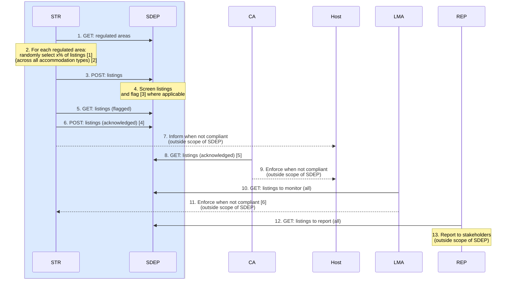
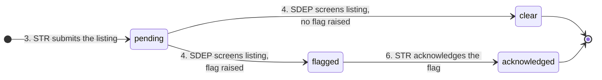

<h1>Listings</h1>

This document provides an overview of SDEP listings.

Status: PROPOSAL / DRAFT.

<h2>Table of Contents</h2>

- [Goal](#goal)
- [Sequence](#sequence)
- [States](#states)
- [Endpoints (new)](#endpoints-new)
  - [EU-harmonized](#eu-harmonized)
  - [Country-specific](#country-specific)
  - [Design Decisions](#design-decisions)
- [Data](#data)
  - [EU-harmonized](#eu-harmonized-1)
  - [Country-specific](#country-specific-1)
  - [Concurrency](#concurrency)
- [Implementation](#implementation)
  - [Schemas](#schemas)
  - [Internal Data Model](#internal-data-model)
  - [Bulk Validation Flow](#bulk-validation-flow)
  - [Remaining Work](#remaining-work)
- [TravelTech](#traveltech)
- [Technical Working Group](#technical-working-group)

## Goal

To support short-term rental **listing regulation**.

## Sequence



---

Legend:

- **STR** - Short-Term Rental Platform
- **SDEP** - Single Digital Entrypoint
- **CA** - Competent Authority
- **Host** - Short-Term Rental Host
- **LMA** - Listing Monitoring Authority
- **REP** - Reporting and Statistics
- Blue is EU-harmonized, the rest is country-specific
- All actions happen periodically/asynchronously

Footnotes:

- 2.[1] x% of listings = listings with addresses located within the regulated area (and repeat this for each regulated area).
- 2.[2] All accommodation types = short-term rentals, hotels, hostels, ...
- 4.[3] For example: a listing registration number and its address mismatch the corresponding record in a registration system.
- 6.[4] Assume there is no need to further enrich the data (such as agree/dispute/remark).
- 8.[5] These are the acknowledged listings with addresses located within a regulated area for which the CA is responsible.
- 11.[6] For example: when the number of randomly selected listings is insufficient.

---

Remarks:

- Process implementations for compliance, monitoring, and reporting are outside the scope of SDEP.

## States



---

Legend:

- `pending` - submitted by the platform, awaiting screening
- `clear` - screened, no flags raised
- `flagged` - screened, [flag code](#eu-harmonized-1) raised, not yet acknowledged
- `acknowledged` - the platform confirmed receipt of the flag

Remarks:

- Every transition creates a new [version](#internal-data-model) of the listing; a listing row is never updated in place.
- A correction is a new version **in the same state** (same concept as for activities), and is only allowed for the actor that owns that state's write. The lifecycle never restarts:
  - `pending`: the platform may correct the listing data (resubmission with the same `listingId`)
  - `clear`, `flagged`: SDEP may correct the screening (resubmission of the screening result); the state follows the new flag(s)
  - `acknowledged`: final, no corrections (the acknowledgement carries no data, SDEP cannot undo it)
- A platform that (still) wants an already screened listing (`clear`, `flagged`, `acknowledged`) corrected submits it under a new (or empty > new) `listingId` (recurrence) = new random check
- A resubmission with a new (or empty > new) `listingId` (recurrence in a new random check) starts a separate lifecycle.
- Flags raised in the `flagged` state are retained after acknowledgement, so `acknowledged` does not erase the screening outcome.
- The correction edges (`pending --> pending` for the platform, `clear|flagged --> clear|flagged` for SDEP) are left out of the diagram for readability.

## Endpoints (new)

*This section will be moved to [technical architecture - API](./ARCHITECTURE_TECH.md#api-versioning).*

Approach:

- POST follows the same logic as STR activities, incl. bulk and REST noun-based collection URLs.
- GET follows the same logic as [CA v2 activities](https://sdep.gov.nl/api/docs), incl. query filters for date/platform/area.
- The EU-harmonized API is separated from the country-specific implementation.

For other motivation and design decisions, see [below](#design-decisions).

---

### EU-harmonized

---

**STR**

| Action | Endpoint                                   | Description                                                                         |
| ------ | ------------------------------------------ | ----------------------------------------------------------------------------------- |
| 3.     | `str: POST /listings/bulk`                 | A platform submits a batch of randomly selected listings.                           |
| 5.     | `str: GET /listings`                       | A platform retrieves its listings that have been flagged by SDEP.                   |
| 5.     | `str: GET /listings/count`                 | Count, to support pagination (as for activities).                                   |
| 6.     | `str: POST /listing-acknowledgements/bulk` | A platform acknowledges a batch of flagged listings (= **random check performed**). |

---

**Filters for `str: GET /listings`.**

Option A. (propose to implement in case of STR): a **fixed `flagged` scope, no `filterStatus`**.

- The endpoint description states "returns flagged listings only"; the OpenAPI specification is honest.
- Declared filters: `filterCreatedAtFrom`, `filterCreatedAtTo`, `filterAreaId`.
- The STR router does not declare `filterStatus`; the handler receives a fixed `status_scope=flagged`, the same way it receives the client scope.
  - It can still be added in a backward compatible way (if it may be needed in the future).
- A `filterFlags` is declared in the country-specific endpoints only (CA etc.) and not declared for STR.
  - The EU-harmonized surface stays minimal.
  - The flag codes are already in every `Listing.Response` the platform receives, so it would only be a convenience.

Option B. (propose not to implement in case of STR): **full `filterStatus`** (`pending`, `clear`, `flagged`, `acknowledged`; optional, default all).

- Most straightforward from an API perspective: one read shape for every audience
- Nothing in any state is secret from the platform: it submitted the data, `pending`/`clear` carry no new information, and the flags are exactly what action 5 delivers
- Lets a platform reconcile its own submissions and acknowledgements
- Not chosen for now, to keep the EU-harmonized surface minimal

Option C. (rejected): **restricted enum** (`filterStatus` declared with a smaller enum, e.g. `flagged` and `acknowledged` only).

- Technically clean (the refusal is a type, 422 on other values, OpenAPI lists only the allowed values)
- Rejected because it introduces a second status enum for one audience without a need; if the platform must see `acknowledged`, the full filter is the simpler step

---

### Country-specific

---

**LSR**

Listing screener (LSR) (country-specific, SDEP-NL/reference): is an **internal** (implementation) component that implements action 4.

The LSR implementation can be:

- **SDEP itself** (querying the `lsr` endpoints, calling external systems for examination, and feeding the results back into the `lsr` endpoints); or
- **An external system** (querying and feeding the `lsr` endpoints).

In either way, the screening implementation stays in SDEP.

- This ensures that the data point between platforms and SDEP remains the listing/registration number.
- Which conforms the [EU Traveltech position paper](#traveltech).

| Action | Endpoint                             | Description                                                                            |
| ------ | ------------------------------------ | -------------------------------------------------------------------------------------- |
| 4.     | `lsr: GET /listings`                 | The listing screener retrieves submitted listings for review (`filterStatus=pending`). |
| 4.     | `lsr: GET /listings/count`           | Count, to support pagination.                                                          |
| 4.     | `lsr: POST /listing-screenings/bulk` | The listing screener submits a batch of screening results with possible flags.         |

Validation of `POST /listing-screenings/bulk`, per item (NOK does not fail the batch, see [Bulk Validation Flow](#bulk-validation-flow)):

- The listing must exist for the given `platformId` and `listingId` (`not_found_error`)
- The current state must be `pending` (initial screening), `clear` or `flagged` (correction, see [States](#states)); a screening on `acknowledged` is refused (`conflict_error`), because the LSR cannot undo an acknowledgement
- The `createdAt` must be the current version of the listing (`conflict_error`), see [Concurrency](#concurrency)
- Every code in `flags` must be a known [flag code](#eu-harmonized-1) (`value_error`)

The LSR can only screen what it can retrieve: the states it may `POST` on are exactly the states it can `GET` (`filterStatus=pending,clear,flagged`), which is why option B applies below.

[Option B](#eu-harmonized) (full `filterStatus`), not option A. Motivation:

- The LSR owns two states it must be able to revisit: a screening correction (see [States](#states)) requires retrieving the `clear` and `flagged` listing states, which a fixed `pending` scope cannot serve
- `filterFlags` is needed for the same reason: a correction is typically per flag code (e.g. re-screen everything flagged `EXP` after a registration-system fix)
- Both filters together also give the current `createdAt` (version token) that the corrected screening must reference, see [Concurrency](#concurrency)
- No harmonization cost: the LSR is a country-specific, internal component

Declared filters: `filterStatus`, `filterFlags`, `filterCreatedAtFrom`, `filterCreatedAtTo`, `filterAreaId`, `filterPlatformId`.

---

**CA**

Competent authority (country-specific, SDEP-NL/reference):

| Action | Endpoint                  | Description                                                                                                             |
| ------ | ------------------------- | ----------------------------------------------------------------------------------------------------------------------- |
| 8.     | `ca: GET /listings`       | A competent authority gets the acknowledged listings in its areas (fixed `acknowledged` scope) for enforcing the hosts. |
| 8.     | `ca: GET /listings/count` | Count, to support pagination.                                                                                           |

Same as [option A](#eu-harmonized) for STR: a fixed `acknowledged` scope, no `filterStatus`.

However, `filterFlag(s)` *is* declared. Motivation:

- The fixed scope returns all acknowledged listings in the CA's areas, which can be a large set
- The flag codes carry different enforcement weight: `UDC` (undeclared short-term rental) or `NPR` (not a private residence) are likely enforcement cases, `EXP` (expired registration number) may be a reminder letter
- `filterFlag(s)` lets the CA pull these groups separately (e.g. `filterFlags=UDC,NPR` first, `EXP` later) instead of fetching everything and sorting client-side
- It is a convenience only: the `flags` array is in every `Listing.Response`, so the CA gets no data it would not already have
- Unlike STR, there is no harmonization cost (country-specific endpoint), so the convenience is kept

Declared filters: `filterFlag(s)`, `filterCreatedAtFrom`, `filterCreatedAtTo`, `filterAreaId`, `filterPlatformId`.

---

**LMA**

Listing monitoring authority (country-specific, SDEP-NL/reference):

| Action | Endpoint                   | Description                                                               |
| ------ | -------------------------- | ------------------------------------------------------------------------- |
| 10.    | `lma: GET /listings`       | A listing monitoring authority gets all listings for monitoring purposes. |
| 10.    | `lma: GET /listings/count` | Count, to support pagination.                                             |

Declared filters: `filterStatus`, `filterFlags`, `filterCreatedAtFrom`, `filterCreatedAtTo`, `filterAreaId`, `filterPlatformId`, `filterCompetentAuthorityId`.

*Will be implemented as second step.*

---

**REP**

Reporting and statistics office (country-specific, SDEP-NL/reference):

| Action | Endpoint                   | Description                                                                 |
| ------ | -------------------------- | --------------------------------------------------------------------------- |
| 12.    | `rep: GET /listings`       | A reporting and statistics office gets all listings for reporting purposes. |
| 12.    | `rep: GET /listings/count` | Count, to support pagination.                                               |

Declared filters: `filterStatus`, `filterFlags`, `filterCreatedAtFrom`, `filterCreatedAtTo`, `filterAreaId`, `filterPlatformId`, `filterCompetentAuthorityId`.

*Will be implemented as second step.*

---

### Design Decisions

In one sentence: a listing is **one thing with a lifecycle** (see [States](#states)); reading it is always `GET /listings`, and every arrow in the state diagram is one `POST`.

| Decision                                                          | In plain words                                                                                                                                                                                                                                                                                                | Why (and what was rejected)                                                                                                                                                                                                                                                                                                                        |
| ----------------------------------------------------------------- | ------------------------------------------------------------------------------------------------------------------------------------------------------------------------------------------------------------------------------------------------------------------------------------------------------------- | -------------------------------------------------------------------------------------------------------------------------------------------------------------------------------------------------------------------------------------------------------------------------------------------------------------------------------------------------- |
| One resource, one URL                                             | Every audience reads listings at the same address, `GET /listings`. The state of a listing (`pending`, `flagged`, ...) is never part of the address; it is either fixed by the endpoint (STR, CA) or chosen with `filterStatus` (LSR, LMA, REP), see the per-audience [filters](#eu-harmonized).              | A listing keeps the same `listingId` while it moves through the states (technical working group: "enrich, ID remains the same"). If the address contained the state, the same listing would move between addresses over time and be reachable at several of them at once. Rejected for that reason: `/flagged-listings`, `/acknowledged-listings`. |
| Every state change is a `POST` to a list named after what is sent | `POST /listings/bulk` puts a listing in `pending`. `POST /listing-screenings/bulk` moves it to `clear` or `flagged`. `POST /listing-acknowledgements/bulk` moves it to `acknowledged`. The name says what the caller sends (a listing, a screening result, an acknowledgement), not what the listing becomes. | Naming the input keeps the write side stable even when the state model changes. Rejected: `/flagged-listings/acknowledgements/bulk`, because a list under a list needs an id in between (`/flagged-listings/{id}/acknowledgements`), and three path levels are a lot for a body that only carries `listingId`.                                     |
| A screening result, not a flag                                    | The LSR sends one screening result per listing with flag code(s). Zero flags means `clear`.                                                                                                                                                                                                                   | The `pending -> clear` arrow needs a write too, and "post zero flags" to a `/listing-flags` list makes no sense. Rejected: `/listing-flags`.                                                                                                                                                                                                       |
| `/bulk` on every write                                            | All three writes take a batch (1-1000 items) and answer per item with OK or NOK, exactly like `POST /activities/bulk`.                                                                                                                                                                                        | One invalid item must not fail the whole batch, and the caller must know which item failed and why. Paths without `/bulk` stay free for single-item endpoints later.                                                                                                                                                                               |
| Filters use the existing names                                    | `filterStatus`, `filterFlags`, `filterCreatedAtFrom`, `filterCreatedAtTo`, `filterAreaId`, `filterPlatformId`, `filterCompetentAuthorityId`.                                                                                                                                                                  | Same names as the CA v2 and REP v1 activity endpoints. Rejected: `?status=`, `?flags=`.                                                                                                                                                                                                                                                            |
| Filters are declared per audience, never refused at runtime       | Each audience (`str`, `lsr`, `ca`, `lma`, `rep`) is its own API with its own OpenAPI document. A filter that an audience may not use is simply not declared there, so it does not appear in that audience's documentation. There is no code that says "refused for STR".                                      | This is how activities already work: REP v1 declares `filterCompetentAuthorityId`, CA v2 does not. Consequences: an unknown value for a declared filter is a validation error (HTTP 422, from the enum type); an undeclared filter is silently ignored, as for every existing endpoint.                                                            |
| Data scope comes from the token, not from a filter                | A platform only ever sees its own listings, a competent authority only the listings in its own areas, the LSR/LMA/REP all listings. This is decided by the `client_id` in the bearer token, not by a query parameter.                                                                                         | Same as activities today. A caller cannot widen its scope by adding or omitting a filter.                                                                                                                                                                                                                                                          |
| The API names are not the database names                          | Externally there are three `POST` lists; internally there is one `Listing` table, and every `POST` creates a new version row of the same listing.                                                                                                                                                             | The external model is for the caller, the internal model for storage (see [DATAMODEL.md](./DATAMODEL.md)). Details in [Implementation](#implementation).                                                                                                                                                                                           |

## Data

Schemas describe the **resource**; bulk/list schemas describe the **transport envelope**, following the Activity pattern (`Activity.Request`, `Activity.Response`, `Activity.BulkRequest`, `Activity.BulkResultItem`, `Activity.BulkResponse`, `Activity.ListResponse`, `Activity.CountResponse`). No endpoint-specific schemas.

---

### EU-harmonized

---

**`Listing.Request`**

Submitted by the platform (`POST /listings/bulk`).

| Field                       | Description                                                                                         |
| --------------------------- | --------------------------------------------------------------------------------------------------- |
| `listingId`                 | Functional ID identifying the listing (versioned = optionally supplied else auto-generated **[1]**) |
| `listingName`               | Display name (optional)                                                                             |
| `areaId`                    | Functional ID referencing the area where the listing is posted                                      |
| `url`                       | References the listing online                                                                       |
| `address`                   | Listing address (same composite as activities)                                                      |
| `declaredAsShortTermRental` | Host self-declaration (yes/no)                                                                      |
| `registrationNumber`        | Listing registration number (**optional**, unlike activities: flag code `ABS` = absent) **[2]**     |

[1] This allows the listing to be submitted as either:

- A correction (same id): allowed in `pending` only, creates a new version that stays `pending`
- A recurrence in a new random check (new id)

[2] `listingId` is unique per platform (as `activityId`), not globally.

---

**`Listing.Response`**

Returned by every `GET /listings` and inside every bulk result item. The request fields, enriched with:

| Field                    | Description                                                                                         |
| ------------------------ | --------------------------------------------------------------------------------------------------- |
| `status`                 | Lifecycle status: `pending`, `clear`, `flagged`, `acknowledged`                                     |
| `flags`                  | [Flag codes](#eu-harmonized-1) raised by screening (empty until screened, non-empty when `flagged`) |
| `screenedAt`             | Timestamp of the screening (optional, UTC)                                                          |
| `acknowledgedAt`         | Timestamp of the acknowledgement (optional, UTC)                                                    |
| `areaName`               | Display name of the area (optional)                                                                 |
| `competentAuthorityId`   | Functional ID of the competent authority that owns the area                                         |
| `competentAuthorityName` | Display name of the competent authority (optional)                                                  |
| `platformId`             | Functional ID of the submitting platform                                                            |
| `platformName`           | Display name of the platform (optional)                                                             |
| `createdAt`              | Timestamp when this listing **version** was created (UTC); doubles as the version token             |

There is no separate `FlaggedListing` schema: a flagged listing is the same resource in state `flagged`, with `flags` populated.

---

**`ListingAcknowledgement.Request`**

Submitted by the platform (`POST /listing-acknowledgements/bulk`), one item per flagged listing.

| Field       | Description                                                     |
| ----------- | --------------------------------------------------------------- |
| `listingId` | The flagged listing (scoped to the authenticated platform)      |
| `createdAt` | The version being acknowledged, see [Concurrency](#concurrency) |

The acknowledgement carries no further data (see sequence footnote 6.[4]).

---

**Flag Codes**

| Code  | Synopsis (description)         | Declared as STR | Registration Number Present | Registration Number Known | Registration Number Valid | Address Matches Registration | Private Residence |
| ----- | ------------------------------ | :-------------: | :-------------------------: | :-----------------------: | :-----------------------: | :--------------------------: | :---------------: |
| `ABS` | Absent Registration Number     |       Yes       |             No              |             -             |             -             |              -               |         -         |
| `UNK` | Unknown Registration Number    |       Yes       |             Yes             |            No             |             -             |              -               |         -         |
| `EXP` | Expired Registration Number    |       Yes       |             Yes             |            Yes            |            No             |              -               |         -         |
| `MIS` | Mismatched Address             |       Yes       |             Yes             |            Yes            |            Yes            |              No              |         -         |
| `NPR` | Not a Private Residence        |       Yes       |             Yes             |            Yes            |            Yes            |             Yes              |        No         |
| `UNX` | Unexpected Registration Number |       No        |             Yes             |             -             |             -             |              -               |         -         |
| `UDC` | Undeclared Short-Term Rental   |       No        |             No              |             -             |             -             |              -               |        Yes        |

*The value "-" denotes "not applicable" (because the decision is already taken based on the other values).*

*For code UDC, the "private residence yes" is expected to be determined by matching the listing address details with a corresponding record in an external system.*

---

### Country-specific

---

**`ListingScreening.Request`**

Submitted by the LSR (`POST /listing-screenings/bulk`), one item per screened listing. The LSR does not send the listing back, only the result.

| Field        | Description                                                                                 |
| ------------ | ------------------------------------------------------------------------------------------- |
| `platformId` | The submitting platform (`listingId` is only unique within a platform)                      |
| `listingId`  | The screened listing                                                                        |
| `createdAt`  | The version that was screened, see [Concurrency](#concurrency)                              |
| `flags`      | Zero or more [flag codes](#eu-harmonized-1); empty means `clear`, non-empty means `flagged` |

---

### Concurrency

The screening window is external and asynchronous, so no database lock can cover it. A platform may correct a listing (new `pending` version) while the LSR is screening the previous version, and the LSR may re-screen while a platform is acknowledging. The flags of one version must never land on another.

Optimistic concurrency, using the version timestamp that every response already carries:

- `ListingScreening.Request` and `ListingAcknowledgement.Request` carry the `createdAt` of the version they refer to
- The server locks the current version (`SELECT ... FOR UPDATE`, as `get_current_by_activity_ids` does for activities) and compares
- Mismatch = per-item NOK with `type: conflict_error`, `loc: ["createdAt"]`; the rest of the batch proceeds and the response stays 200 with `succeeded`/`failed` counts, exactly like an unknown `areaId` today
- No retry path is needed: the corrected listing is still `pending` and appears in the LSR's next `GET /listings?filterStatus=pending` with its new data; the re-screened listing is `flagged` again and appears in the platform's next `GET /listings`

Example bulk result item:

```json
{
  "listingIndex": 3,
  "listingId": "abc-123",
  "status": "NOK",
  "errors": {
    "detail": [
      {
        "msg": "Listing 'abc-123' version '2026-09-07T08:00:00Z' is no longer current",
        "type": "conflict_error",
        "loc": ["createdAt"]
      }
    ]
  }
}
```

## Implementation

*This section will be moved to [technical architecture - API](./ARCHITECTURE_TECH.md#api-versioning).*

---

### Schemas

Dotted titles, as the existing OpenAPI specification (`model_config = ConfigDict(title="Activity.Request")`):

```text
Listing.Request | .Response | .BulkRequest | .BulkResultItem | .BulkResponse | .ListResponse | .CountResponse
Listing.Status | Listing.Flag                                                   (enums)
ListingScreening.Request | .BulkRequest | .BulkResultItem | .BulkResponse
ListingAcknowledgement.Request | .BulkRequest | .BulkResultItem | .BulkResponse
```

- Bulk result items for screenings and acknowledgements return the resulting `Listing.Response` (the new version), so there is no `ListingScreening.Response` or `ListingAcknowledgement.Response`
- `Listing.BulkRequest.listings` uses `SkipValidation` per item, as `Activity.BulkRequest`, so one invalid item is NOK without failing the batch

---

### Internal Data Model

One new class, **`Listing`**, mirroring `Activity` (see [DATAMODEL.md](./DATAMODEL.md)). No `ListingScreening` or `ListingAcknowledgement` class.

| Attribute                              | Type               | Constraints                                                                    |
| :------------------------------------- | :----------------- | :----------------------------------------------------------------------------- |
| **id**, **listingId**, **listingName** | int / string       | standard pattern; `listingId` supplied or auto-generated (UUIDv4)              |
| **status**                             | enum               | required, `pending` (default), `clear`, `flagged`, `acknowledged`              |
| **platform**, **area**                 | reference          | required, as Activity                                                          |
| **url**, **address**                   | string / composite | required, as Activity (Address composite reused as-is)                         |
| **declaredAsShortTermRental**          | bool               | required                                                                       |
| **registrationNumber**                 | string             | **optional**, length \<= 32                                                    |
| **flags**                              | array of string    | required, may be empty; each a flag code (`StringArray`, as `countryOfGuests`) |
| **screenedAt**                         | datetime           | optional, UTC                                                                  |
| **acknowledgedAt**                     | datetime           | optional, UTC                                                                  |
| **createdAt**, **endedAt**             | datetime           | standard versioning                                                            |

Class constraints:

- UNIQUE (`listingId`, `platform`, `createdAt`) = functional id, owner, version timestamp
- CHECK (`listingId` matches `^[A-Za-z0-9-]+$`)
- CHECK (`status` in (`flagged`, `acknowledged`) ⇒ `flags` non-empty; `status` in (`pending`, `clear`) ⇒ `flags` empty)

**Every transition is a new version** (mark the current version ended, insert the new one), reusing the activity versioning machinery (`bulk_mark_as_ended` + insert under `FOR UPDATE`). No listing row is ever updated in place.

| Transition                              | Actor | Precondition (current version)                   | New version                                       |
| --------------------------------------- | ----- | ------------------------------------------------ | ------------------------------------------------- |
| `POST /listings/bulk` (new `listingId`) | STR   | none                                             | `pending`                                         |
| `POST /listings/bulk` (correction)      | STR   | `pending`                                        | `pending`                                         |
| `POST /listing-screenings/bulk`         | LSR   | `pending`, `clear` or `flagged`; version matches | `clear` (no flags) or `flagged`, `screenedAt` set |
| `POST /listing-acknowledgements/bulk`   | STR   | `flagged`; version matches                       | `acknowledged`, `acknowledgedAt` set              |

A failed precondition is a per-item NOK (`conflict_error`), see [Concurrency](#concurrency).

Motivation:

- Literal reading of the [technical working group](#technical-working-group) decision "enrich, so ID remains the same": one `listingId`, one row per state
- Each actor may correct its own contribution while the listing is in the state it owns, so fields are rewritten; versioning is the established mechanism for "rewrite with history"
- `createdAt` already means "timestamp when this version was created" for activities, and doubles as the concurrency token
- Every read filter is a plain `WHERE` on one table; history is available for reporting
- Version churn is not a concern: random checks cover x% of listings

Rejected alternatives:

- *Enrichment columns updated in place* (`flags`, `screenedAt`, `acknowledgedAt` written on the current row): simplest while the columns were write-once; once corrections rewrite them, in-place updates lose history and are the only UPDATE of business data in the model. Fallback if version volume ever matters.
- *Separate `ListingScreening` and `ListingAcknowledgement` classes* (insert-only): two extra tables, a "latest screening" join on every read, and a functional-id question for records that do not need one.
- *Copy the listing on screening* (a separate flagged record): breaks the ID correlation the technical working group asked for.

---

### Bulk Validation Flow

Same four steps as `POST /activities/bulk`:

1. Syntax and semantic validation per item
2. Referential integrity: `areaId` exists **and** `Area.regulation` in (`listing`, `all`) **[1]**; for screenings and acknowledgements: the listing exists and the version matches ([Concurrency](#concurrency))
3. Versioning: mark the current version ended, insert the new version
4. Feedback: per-item OK/NOK with the resulting `Listing.Response`

[1] The activity bulk RI check verifies existence only and ignores `Area.regulation`; see [Remaining Work](#remaining-work). Both checks share one `get_area_ca_map(session, ids, regulation=...)`.

---

### Remaining Work

- Keycloak roles `sdep_lsr` and `sdep_lma`, plus `Role` enum entries (`Role` currently has CA, STR, REP, READ, WRITE)
- Domain sub-apps `/api/lsr/v1` and `/api/lma/v1` in `API_DOMAINS` (currently AUTH, CA v1/v2, STR, REP)
- Regulation check in the RI step, for listings and activities
- New files mirroring the activity set one-for-one: `models/listing.py`, `crud/listing.py`, `schemas/listing.py` + `listing_bulk.py`, `services/listing_bulk.py` (+ screening and acknowledgement bulk services), one router per domain, one migration
- DATAMODEL.md: `Listing` section and overview edge (`Platform --> Listing`, `Listing --> Area`)
- Confirm the fixed scopes (STR `flagged`, CA `acknowledged`, option A) versus the full `filterStatus` (option B, as for LSR) with the technical working group

## TravelTech

The EU Traveltech position paper (available on request) matches the above design:

| EU Traveltech                                                                                                                                                                                                                                                                                                                                         | Design                                                                          |
| ----------------------------------------------------------------------------------------------------------------------------------------------------------------------------------------------------------------------------------------------------------------------------------------------------------------------------------------------------- | ------------------------------------------------------------------------------- |
| *Where random checks reveal incorrect host declarations on the existence or not of a registration procedure, misuse of a registration number, or invalid registration numbers, platforms must inform both the competent authorities and the host concerned without undue delay.*                                                                      | OK, see [actions 6,7,8](#sequence)                                              |
| *Article 13(1)(a) requires Member States to draw up, make available through the SDEP, and regularly update, the list of areas where a registration procedure applies.*                                                                                                                                                                                | OK, see [Areas](./AREA.md)                                                      |
| *Article 10(3)(b) further requires the SDEP to provide ‘a freely accessible and machine-readable online database or online interface’ for those checks*                                                                                                                                                                                               | OK, this is the SDEP API                                                        |
| *In our view, Article 7(1)(c) focuses solely on verifying the validity of the registration number itself. In practice, this means that the **registration number is the data point** used by platforms to perform the check, by submitting it through the functionalities made available via the SDEP and receiving confirmation as to its validity.* | OK, see [action 3](#sequence) and the [Listing](#eu-harmonized-1) datastructure |

## Technical Working Group

Discussion:

| Context                                                                      | Issue                                                                     | Proposal                                                                   |
| ---------------------------------------------------------------------------- | ------------------------------------------------------------------------- | -------------------------------------------------------------------------- |
| Listing screening & acknowledgement                                          | Enrich (version) the existing listing record, or copy it?                 | Enrich, so ID remains the same (correlation)                               |
| Listing screening                                                            | Address mismatch (MIS) check required on top of registration number check |                                                                            |
| Listing screening > hpw to match address listing vs registration system      | Match addresses not fuzzy, but do match case-insensitively                |                                                                            |
| The listing reappears in a subsequent screening vs. correction               | Versioning?                                                               | Yes/uniform; correction (update/single active) vs. extra (new/both active) |
| The listing reappears in a subsequent screening and is flagged again         | The host gets double notified                                             | This is a CA responsibiliy                                                 |
| Platform acknowledged and wants to inform host                               | Insert extra CA-acknowlegdement                                           |                                                                            |
| Release gradually via [API status indicator](./API.md#status-indicator)      | Define roadmap for alpha, beta, stable (freeze)                           |                                                                            |
| Flag codes                                                                   | One, or "one or more flag codes                                           | The first flag already "wins"/is relevant?                                 |
| FFlag codes                                                                  | Make "clear" also an explicit flag code                                   | **[1]**                                                                    |
| New API version (v2) makes it possible to [release early](./API.md#contract) | Include functionalites that lead to incompatibility                       | **[2]**                                                                    |

[1] Opinion: keep "zero flags = clear", don't add CLR.

Why:

- A flag marks a problem. clear is the absence of a problem. Putting it in the same list makes the list mean two things at once, and every consumer then has to special-case it ("filter on flags, but ignore CLR").
- The decision table wouldn't fit it. Each row in Flag Codes is a failed path through the checks. CLR would be the one row where every column is "Yes" - a different kind of thing dressed as a code.
- It's already represented, twice. status = clear says it, and flags = [] says it. A third representation (flags = ["CLR"]) invites inconsistency: a CHECK constraint would have to enforce status = clear ⇔ flags = ["CLR"] instead of the simpler flags empty.
- It breaks filterFlags semantics. filterFlags=UDC,NPR means "listings with a problem in this set". With CLR in the vocabulary, a CA could ask for filterFlags=CLR, which is just filterStatus=clear under another name - two filters for one question.
- Explicit "nothing found" is still explicit. The LSR states it by submitting a screening result with flags: []; the state moves pending → clear, screenedAt is set. Nothing is implicit or missed.

The one argument for CLR is readability of a raw payload ("was this screened, or did someone forget the flags?"). That's answered by screenedAt and status, not by a code.

[2] For example:

- Expand the v2 (beta) CA GET filters (e.g. `createdFrom`, `createdTo`, ...) to align with the v2 (beta) STR GET filters (e.g. `areas`).
- Address max length https://github.com/SEMICeu/sdep/issues/75, which will result in platforms receiving larger data fields.
