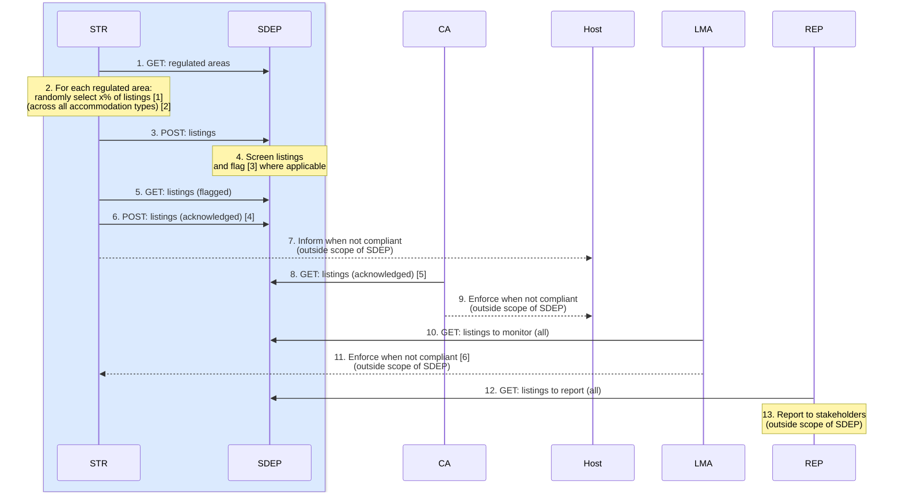
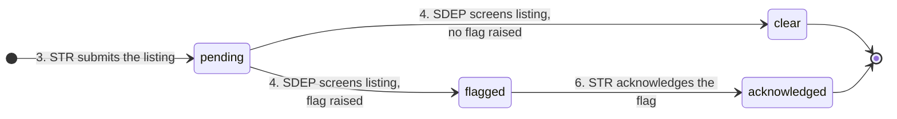

<h1>Listings</h1>

This document provides an overview of SDEP listings, including **random checks**.

Status: PROPOSAL / DRAFT.

<h2>Table of Contents</h2>

- [Goal](#goal)
- [Sequence](#sequence)
- [States](#states)
- [Endpoints (new)](#endpoints-new)
  - [EU-harmonized](#eu-harmonized)
  - [Country-specific](#country-specific)
  - [Design Decisions](#design-decisions)
- [Data](#data)
  - [`Listing.Request`](#listingrequest)
  - [`ListingAcknowledgement.Request`](#listingacknowledgementrequest)
  - [`ListingScreening.Request`](#listingscreeningrequest)
  - [`Listing.Response`](#listingresponse)
- [Implementation](#implementation)
  - [Schemas](#schemas)
  - [Internal Data Model](#internal-data-model)
  - [Transitions](#transitions)
  - [Validation](#validation)
  - [Remaining Work](#remaining-work)
- [TravelTech](#traveltech)
- [Technical Working Group](#technical-working-group)

## Goal

To support short-term rental **listing regulation**.

## Sequence



---

Legend:

- **STR** - Short-Term Rental Platform
- **SDEP** - Single Digital Entrypoint
- **CA** - Competent Authority
- **Host** - Short-Term Rental Host
- **LMA** - Listing Monitoring Authority
- **REP** - Reporting and Statistics
- Blue is EU-harmonized, the rest is country-specific
- All actions happen periodically/asynchronously

Footnotes:

- 2.[1] x% of listings = listings with addresses located within the regulated area (and repeat this for each regulated area).
- 2.[2] All accommodation types = short-term rentals, hotels, hostels, ...
- 4.[3] For example: a listing registration number and its address mismatch the corresponding record in a registration system.
- 6.[4] Assume there is no need to further enrich the data (such as agree/dispute/remark).
- 8.[5] These are the acknowledged listings with addresses located within a regulated area for which the CA is responsible.
- 11.[6] For example: when the number of randomly selected listings is insufficient.

---

Remarks:

- Process implementations for compliance, monitoring, and reporting are outside the scope of SDEP.

## States



---

Legend:

- `pending` - submitted by the platform, awaiting screening
- `clear` - screened, no flags raised
- `flagged` - screened, [flag code(s)](#listingresponse) raised, not yet acknowledged
- `acknowledged` - the platform confirmed receipt of the flag

Remarks:

- Every transition creates a new [version](#internal-data-model) of the listing; a listing row is never updated in place.
- A correction is a new version **in the same state** (same concept as for activities), and is only allowed for the actor that owns that state's write. The lifecycle never restarts:
  - `pending`: the platform may correct the listing data (resubmission with the same `listingId`)
  - `clear`, `flagged`: SDEP may correct the screening (resubmission of the screening result); the state follows the new flag(s)
  - `acknowledged`: final, no corrections (the acknowledgement carries no data, SDEP cannot undo it)
- A platform that (still) wants an already screened listing (`clear`, `flagged`, `acknowledged`) corrected submits it under a new (or empty > new) `listingId` (recurrence) = new random check
- A resubmission with a new (or empty > new) `listingId` (recurrence in a new random check) starts a separate lifecycle.
- Flags raised in the `flagged` state are retained after acknowledgement, so `acknowledged` does not erase the screening outcome.
- The correction edges (`pending --> pending` for the platform, `clear|flagged --> clear|flagged` for SDEP) are left out of the diagram for readability.

## Endpoints (new)

*This section will be moved to [technical architecture - API](./ARCHITECTURE_TECH.md#api-versioning).*

Approach:

- POST follows the same logic as STR activities, incl. bulk and REST noun-based collection URLs.
- GET follows the same logic as [CA v2 activities](https://sdep.gov.nl/api/docs), incl. query filters for date/platform/area.
- The EU-harmonized API is separated from the country-specific implementation.

For other motivation and design decisions, see [below](#design-decisions).

---

### EU-harmonized

---

**STR**

| Action | Endpoint                                   | Description                                                                                |
| ------ | ------------------------------------------ | ------------------------------------------------------------------------------------------ |
| 3.     | `str: POST /listings/bulk`                 | A platform submits a batch of randomly selected listings.                                  |
| 5.     | `str: GET /listings`                       | A platform retrieves its listings that have been flagged by SDEP (`filterStatus=flagged`). |
| 5.     | `str: GET /listings/count`                 | Count, to support pagination (as for activities).                                          |
| 6.     | `str: POST /listing-acknowledgements/bulk` | A platform acknowledges a batch of flagged listings (= **random check performed**).        |

For data structures, see [Data](#data).

For POST validations, see [Validation](#validation).

---

**Filters for `str: GET /listings`.**

- `filterCreatedAtFrom`
- `filterCreatedAtTo`
- `filterAreaId`

Implementation notes:

- The STR router does not declare `filterStatus`; the handler receives a fixed `status_scope=flagged`, the same way it receives the client scope.
- A `filterStatus` can still be added in a backward compatible way (if needed in the future).

Alternative: add `filterStatus` (`pending`, `clear`, `flagged`, `acknowledged`; optional, default all).

- This would allow an STR to get the full (process-wise) status on its listings
- Propose not to implement: an STR does not need this information

---

### Country-specific

---

**LSR**

Listing screener (LSR) (country-specific, SDEP-NL/reference): is an **internal** (implementation) component that implements action 4 (screen listings) within SDEP.

The LSR implementation can be:

- **SDEP itself** (querying the `lsr` endpoints, calling external systems for examination, and feeding the results back into the `lsr` endpoints); or
- **An external system** (querying and feeding the `lsr` endpoints).

In either way, the screening implementation stays in SDEP.

- This ensures that the data point between platforms and SDEP remains the listing/registration number.
- Which conforms to the [EU Traveltech position paper](#traveltech).

| Action | Endpoint                             | Description                                                                            |
| ------ | ------------------------------------ | -------------------------------------------------------------------------------------- |
| 4.     | `lsr: GET /listings`                 | The listing screener retrieves submitted listings for review (`filterStatus=pending`). |
| 4.     | `lsr: GET /listings/count`           | Count, to support pagination.                                                          |
| 4.     | `lsr: POST /listing-screenings/bulk` | The listing screener submits a batch of screening results with possible flags.         |

For data structures, see [Data](#data).

For POST validations, see [Validation](#validation).

---

**Filters for `lsr: GET /listings`.**

- `filterCreatedAtFrom`
- `filterCreatedAtTo`
- `filterAreaId`
- `filterPlatformId`

Notes:

- The additional `filterAreaId` and `filterPlatformId` can be used to group/process by area and/or by platform.

---

**CA**

Competent authority (country-specific, SDEP-NL/reference):

| Action | Endpoint                  | Description                                                                                                              |
| ------ | ------------------------- | ------------------------------------------------------------------------------------------------------------------------ |
| 8.     | `ca: GET /listings`       | A competent authority gets the acknowledged listings in its areas (`filterStatus=acknowledged`) for enforcing the hosts. |
| 8.     | `ca: GET /listings/count` | Count, to support pagination.                                                                                            |

For data structures, see [Data](#data).

---

**Filters for `ca: GET /listings`.**

- `filterCreatedAtFrom`
- `filterCreatedAtTo`
- `filterAreaId`
- `filterPlatformId`
- `filterFlags`

Notes:

- The additional `filterFlags` can be used to group/process by flags
- For example: first `filterFlags=UDS` (undeclared short-term rental), then `EXP` (expired)

---

**LMA**

Listing monitoring authority (country-specific, SDEP-NL/reference):

| Action | Endpoint                   | Description                                                               |
| ------ | -------------------------- | ------------------------------------------------------------------------- |
| 10.    | `lma: GET /listings`       | A listing monitoring authority gets all listings for monitoring purposes. |
| 10.    | `lma: GET /listings/count` | Count, to support pagination.                                             |

For data structures, see [Data](#data).

---

**Filters for `lma: GET /listings`.**

- `filterCreatedAtFrom`
- `filterCreatedAtTo`
- `filterAreaId`
- `filterPlatformId`
- `filterFlags`
- `filterStatus`

Notes:

- The additional `filterStatus` allows for full-monitoring

*Will be implemented as second step.*

---

**REP**

Reporting and statistics office (country-specific, SDEP-NL/reference):

| Action | Endpoint                   | Description                                                                 |
| ------ | -------------------------- | --------------------------------------------------------------------------- |
| 12.    | `rep: GET /listings`       | A reporting and statistics office gets all listings for reporting purposes. |
| 12.    | `rep: GET /listings/count` | Count, to support pagination.                                               |

For data structures, see [Data](#data).

---

**Filters for `rep: GET /listings`.**

- `filterCreatedAtFrom`
- `filterCreatedAtTo`
- `filterAreaId`
- `filterPlatformId`
- `filterFlags`
- `filterStatus`

Notes:

- The additional `filterStatus` allows for full-reporting

*Will be implemented as second step.*

---

### Design Decisions

A listing is **one thing with a lifecycle** (see [States](#states)): reading it is always `GET /listings`, and every arrow in the state diagram is one `POST`.

| Decision                                                    | Motivation                                                                                                                                                             |
| ----------------------------------------------------------- | ---------------------------------------------------------------------------------------------------------------------------------------------------------------------- |
| One read endpoint for everyone: `GET /listings`             | A listing keeps its `listingId` while it moves through the states. The state is fixed per audience (STR, CA, ...).                                                     |
| One `POST` per state change, named after what is sent       | `/listings`, `/listing-screenings`, `/listing-acknowledgements` say what the caller sends, not what the listing becomes.                                               |
| The LSR always sends a screening result, not only "flagged" | The `pending -> clear` step needs a write too.                                                                                                                         |
| A `/bulk` on every write                                    | One invalid item must not fail the batch, and the caller must know which item failed and why. Same as `POST /activities/bulk`.                                         |
| Filters keep the existing names                             | `filterStatus`, `filterFlags`, `filterCreatedAtFrom`, ... as the activity endpoints. Rejected: `?status=`, `?flags=`.                                                  |
| Filters are declared per audience, never refused at runtime | Each audience has its own API and OpenAPI document; a filter it may not use is simply not declared there.                                                              |
| Data scope comes from the bearer token, not from a filter   | A platform sees its own listings, a competent authority its own areas, LSR/LMA/REP everything - decided by `client_id`. A caller cannot widen its scope with a filter. |
| API names are not database names                            | Three `POST` lists outside, one `Listing` table inside, where every `POST` adds a version of the same listing. See [Implementation](#implementation).                  |

## Data

Schemas describe the **resource**; bulk/list schemas describe the **transport envelope**, following the Activity pattern (`Activity.Request`, `Activity.Response`, `Activity.BulkRequest`, `Activity.BulkResultItem`, `Activity.BulkResponse`, `Activity.ListResponse`, `Activity.CountResponse`). No endpoint-specific schemas.

---

### `Listing.Request`

Submitted by the platform (`POST /listings/bulk`).

| Field                       | Description                                                                                             |
| --------------------------- | ------------------------------------------------------------------------------------------------------- |
| `listingId`                 | Functional ID identifying the listing (versioned = optionally supplied, else auto-generated **[1][2]**) |
| `listingName`               | Display name (optional)                                                                                 |
| `areaId`                    | Functional ID referencing the area where the listing is posted                                          |
| `url`                       | References the listing online                                                                           |
| `address`                   | Listing address (same composite as activities)                                                          |
| `declaredAsShortTermRental` | Host self-declaration (yes/no)                                                                          |
| `registrationNumber`        | Listing registration number (optional)                                                                  |

[1] This allows the listing to be submitted as either:

- A correction (same id): allowed in `pending` only, creates a new version that stays `pending`
- A recurrence in a new random check (new id)

[2] `listingId` is unique per platform (as `activityId`), not globally.

---

### `ListingAcknowledgement.Request`

Submitted by the STR platform (`POST /listing-acknowledgements/bulk`), one item per flagged listing.

| Field       | Description                                                    |
| ----------- | -------------------------------------------------------------- |
| `listingId` | The flagged listing (scoped to the authenticated platform)     |
| `createdAt` | The version being acknowledged, see [Concurrency](#validation) |

The acknowledgement carries no further data (see sequence footnote 6.[4]).

---

### `ListingScreening.Request`

Submitted by the LSR (`POST /listing-screenings/bulk`), one item per screened listing. The LSR does not send the listing back, only the result.

| Field        | Description                                                                                 |
| ------------ | ------------------------------------------------------------------------------------------- |
| `platformId` | The submitting platform (`listingId` is only unique within a platform)                      |
| `listingId`  | The screened listing                                                                        |
| `createdAt`  | The version that was screened, see [Concurrency](#validation)                               |
| `flags`      | Zero or more [flag codes](#listingresponse); empty means `clear`, non-empty means `flagged` |

---

### `Listing.Response`

Returned by every `GET /listings`, and embedded in every OK item of the [three bulk responses](#schemas). Comprises the request fields, enriched with:

| Field                    | Description                                                                                                   |
| ------------------------ | ------------------------------------------------------------------------------------------------------------- |
| `status`                 | Lifecycle status: `pending`, `clear`, `flagged`, `acknowledged`                                               |
| `flags`                  | **Flag codes** raised by screening (empty until screened, non-empty when screened as (`status` is) `flagged`) |
| `submittedAt`            | Timestamp of the platform's submission (UTC); unchanged by screening and acknowledgement                      |
| `screenedAt`             | Timestamp of the screening (optional, UTC)                                                                    |
| `acknowledgedAt`         | Timestamp of the acknowledgement (optional, UTC)                                                              |
| `areaName`               | Display name of the area (optional)                                                                           |
| `competentAuthorityId`   | Functional ID of the competent authority that owns the area                                                   |
| `competentAuthorityName` | Display name of the competent authority (optional)                                                            |
| `platformId`             | Functional ID of the submitting platform                                                                      |
| `platformName`           | Display name of the platform (optional)                                                                       |
| `createdAt`              | Timestamp when this listing version was created (UTC)                                                         |

---

**Flag Codes**

| Code  | Synopsis (description)         | Declared as STR | Registration Number Present | Registration Number Known | Registration Number Valid | Address Matches Registration | Private Residence |
| ----- | ------------------------------ | :-------------: | :-------------------------: | :-----------------------: | :-----------------------: | :--------------------------: | :---------------: |
| `ABS` | Absent Registration Number     |       Yes       |             No              |             -             |             -             |              -               |         -         |
| `UNK` | Unknown Registration Number    |       Yes       |             Yes             |            No             |             -             |              -               |         -         |
| `EXP` | Expired Registration Number    |       Yes       |             Yes             |            Yes            |            No             |              -               |         -         |
| `MIS` | Mismatched Address             |       Yes       |             Yes             |            Yes            |            Yes            |              No              |         -         |
| `NPR` | Not a Private Residence        |       Yes       |             Yes             |            Yes            |            Yes            |             Yes              |        No         |
| `UNX` | Unexpected Registration Number |       No        |             Yes             |             -             |             -             |              -               |         -         |
| `UDS` | Undeclared Short-Term Rental   |       No        |             No              |             -             |             -             |              -               |        Yes        |

*The value "-" denotes "not applicable" (because the decision is already taken based on the other values).*

*For code UDS, the "private residence yes" is expected to be determined by matching the listing address details with a corresponding record in an external system.*

---

## Implementation

*This section will be moved to [technical architecture - API](./ARCHITECTURE_TECH.md#api-versioning).*

---

### Schemas

Dotted titles, similar to the existing OpenAPI specification (`model_config = ConfigDict(title="Activity.Request")`):

```text
Listing.Request | .Response | .BulkRequest | .BulkResultItem | .BulkResponse | .ListResponse | .CountResponse
Listing.Status | Listing.Flag                                                   (enums)
ListingScreening.Request | .BulkRequest | .BulkResultItem | .BulkResponse
ListingAcknowledgement.Request | .BulkRequest | .BulkResultItem | .BulkResponse
```

The three bulk responses and what an OK item embeds:

| Endpoint                              | Bulk response                         | OK item embeds                                           |
| ------------------------------------- | ------------------------------------- | -------------------------------------------------------- |
| `POST /listings/bulk`                 | `Listing.BulkResponse`                | `Listing.Response`, the new `pending` version            |
| `POST /listing-screenings/bulk`       | `ListingScreening.BulkResponse`       | `Listing.Response`, the new `clear` or `flagged` version |
| `POST /listing-acknowledgements/bulk` | `ListingAcknowledgement.BulkResponse` | `Listing.Response`, the new `acknowledged` version       |

- A NOK item embeds `errors` instead, as `Activity.BulkResultItem` does today
- Because every OK item returns the listing as it now is, there is no `ListingScreening.Response` or `ListingAcknowledgement.Response`
- `Listing.BulkRequest.listings` uses `SkipValidation` per item, as `Activity.BulkRequest`, so one invalid item can be NOK without failing the batch

---

### Internal Data Model

One new class, **`Listing`**, mirroring `Activity` (see [DATAMODEL.md](./DATAMODEL.md)). No `ListingScreening` or `ListingAcknowledgement` class.

| Attribute                              | Type               | Constraints                                                                    |
| :------------------------------------- | :----------------- | :----------------------------------------------------------------------------- |
| **id**, **listingId**, **listingName** | int / string       | standard pattern; `listingId` supplied or auto-generated (UUIDv4)              |
| **status**                             | enum               | required, `pending` (default), `clear`, `flagged`, `acknowledged`              |
| **platform**, **area**                 | reference          | required, as Activity                                                          |
| **url**, **address**                   | string / composite | required, as Activity (Address composite reused as-is)                         |
| **declaredAsShortTermRental**          | bool               | required                                                                       |
| **registrationNumber**                 | string             | **optional**, length \<= 32                                                    |
| **flags**                              | array of string    | required, may be empty; each a flag code (`StringArray`, as `countryOfGuests`) |
| **submittedAt**                        | datetime           | required, UTC; set by the platform's submission, copied forward otherwise      |
| **screenedAt**                         | datetime           | optional, UTC                                                                  |
| **acknowledgedAt**                     | datetime           | optional, UTC                                                                  |
| **createdAt**, **endedAt**             | datetime           | standard versioning                                                            |

Class constraints:

- UNIQUE (`listingId`, `platform`, `createdAt`) = functional id, owner, version timestamp
- CHECK (`listingId` matches `^[A-Za-z0-9-]+$`)
- CHECK (`status` in (`flagged`, `acknowledged`) ⇒ `flags` non-empty; `status` in (`pending`, `clear`) ⇒ `flags` empty)

---

### Transitions

**Every transition is a new version** (mark the current version ended, insert the new one), reusing the activity versioning machinery (`bulk_mark_as_ended` + insert under `FOR UPDATE`). No listing row is ever updated in place.

Every new version gets a new `createdAt` (the version timestamp). The actor timestamps below are set by the write that owns them and copied forward otherwise.

| Transition                                   | Actor | Precondition (current version)        | In new version                     |
| -------------------------------------------- | ----- | ------------------------------------- | ---------------------------------- |
| `POST /listings/bulk` (new `listingId`)      | STR   | none                                  | `pending`, `submittedAt`           |
| `POST /listings/bulk` (correction)           | STR   | `pending`                             | `pending`, `submittedAt`           |
| `POST /listing-screenings/bulk`              | LSR   | `pending`; version matches            | `clear` or `flagged`, `screenedAt` |
| `POST /listing-screenings/bulk` (correction) | LSR   | `clear` or `flagged`; version matches | `clear` or `flagged`, `screenedAt` |
| `POST /listing-acknowledgements/bulk`        | STR   | `flagged`; version matches            | `acknowledged`, `acknowledgedAt`   |

There is no "acknowledgement (correction)": it carries no data. A accidentally retried acknowledgement carries the `flagged` version's `createdAt`, which is no longer current, and is refused with `conflict_error`; the platform treats that as "already acknowledged".

A failed precondition is a per-item NOK (`conflict_error`), see [Concurrency](#validation).

Motivation:

- Each actor may correct its own contribution while the listing is in the state it owns, so fields are rewritten; versioning is the established mechanism for "rewrite with history"
- `createdAt` is purely the version timestamp, as for activities, and doubles as the concurrency token; the actor timestamps (`submittedAt`, `screenedAt`, `acknowledgedAt`) are separate fields
- Every read filter is a plain `WHERE` on one table; history is available for reporting

Rejected alternatives:

- *Enrichment columns updated in place* (`flags`, `screenedAt`, `acknowledgedAt` written on the current row): simplest while the columns were write-once; once corrections rewrite them, in-place updates lose history and are the only UPDATE of business data in the model. Fallback if version volume ever matters.
- *Separate `ListingScreening` and `ListingAcknowledgement` classes* (insert-only): two extra tables, a "latest screening" join on every read, and a functional-id question for records that do not need one.
- *Copy the listing on screening* (a separate flagged record): breaks ID correlation.

---

### Validation

All three POST (writes) use the four-step flow of `POST /activities/bulk`:

1. Syntax and semantics per item (Pydantic)
2. Referential integrity (one query per batch)
3. Versioning: checks on the locked current version (`SELECT ... FOR UPDATE`, as `get_current_by_activity_ids` does for activities), then mark it ended and insert the new version
4. Feedback: per-item OK/NOK with the resulting `Listing.Response` (a NOK item does not fail the batch)

The response is 200 with `succeeded`/`failed` counts and per-item feedback.

The step number says **when** a check runs. Step 3 checks must run on the locked current version: a state change creates a new version, so a state or `createdAt` read before the lock would be stale.

For `POST /listings/bulk`:

- Step 1 - all `Listing.Request` fields are syntactically and semantically valid (`value_error`)
- Step 2 - `areaId` exists and `Area.regulation` is in (`listing`, `all`) (`not_found_error`) **[1]**
- Step 3 - state precondition: no current version for `listingId` (new listing), or the current version is `pending` (correction) (`conflict_error`)
- No version token: the platform corrects its own `pending` listing, and the only thing that can interfere is the LSR screening it first, which the state precondition catches

For `POST /listing-screenings/bulk`:

- Step 1 - `platformId` and `listingId` match the functional ID format, `createdAt` is a UTC timestamp, every code in `flags` is a known [flag code](#listingresponse) (`value_error`)
- Step 2 - the listing exists for `platformId` + `listingId` (`not_found_error`)
- Step 3 - `createdAt` is the current version (`conflict_error`), see [Concurrency](#validation)
- Step 3 - state precondition: `pending` (initial screening), `clear` or `flagged` (correction); `acknowledged` is refused (`conflict_error`), see [Transitions](#transitions)

For `POST /listing-acknowledgements/bulk`:

- Step 1 - `listingId` matches the functional ID format, `createdAt` is a UTC timestamp (`value_error`)
- Step 2 - the listing exists for the authenticated platform (`not_found_error`)
- Step 3 - `createdAt` is the current version (`conflict_error`); a retried acknowledgement fails here, see [Transitions](#transitions)
- Step 3 - state precondition: `flagged` (`conflict_error`)

[1] The activity bulk RI check verifies existence only and ignores `Area.regulation`; see [Remaining Work](#remaining-work). Both checks share one `get_area_ca_map(session, ids, regulation=...)`.

---

**Concurrency**

The screening window is external and asynchronous, so no database lock can cover it. A platform may correct a listing (new `pending` version) while the LSR is screening the previous version, and the LSR may re-screen while a platform is acknowledging. The flags of one version must never land on another.

Optimistic concurrency, using the version timestamp that every response already carries:

- `ListingScreening.Request` and `ListingAcknowledgement.Request` carry the `createdAt` of the version they refer to
- Step 3 locks the current version and compares; mismatch = per-item NOK with `type: conflict_error`, `loc: ["createdAt"]`
- No retry path is needed (a retried acknowledgement is refused as no longer current, see [Transitions](#transitions)): the corrected listing is still `pending` and appears in the LSR's next `GET /listings?filterStatus=pending` with its new data; the re-screened listing is `flagged` again and appears in the platform's next `GET /listings`

Example bulk result item:

```json
{
  "listingIndex": 3,
  "listingId": "abc-123",
  "status": "NOK",
  "errors": {
    "detail": [
      {
        "msg": "Listing 'abc-123' version '2026-09-07T08:00:00Z' is no longer current",
        "type": "conflict_error",
        "loc": ["createdAt"]
      }
    ]
  }
}
```

---

### Remaining Work

- Keycloak roles `sdep_lsr` and `sdep_lma`, plus `Role` enum entries (`Role` currently has CA, STR, REP, READ, WRITE)
- Domain sub-apps `/api/lsr/v1` and `/api/lma/v1` in `API_DOMAINS` (currently AUTH, CA v1/v2, STR, REP)
- Regulation check in the RI step, for listings and activities
- New files mirroring the activity set one-for-one: `models/listing.py`, `crud/listing.py`, `schemas/listing.py` + `listing_bulk.py`, `services/listing_bulk.py` (+ screening and acknowledgement bulk services), one router per domain, one migration
- DATAMODEL.md: `Listing` section and overview edge (`Platform --> Listing`, `Listing --> Area`)

## TravelTech

The EU Traveltech position paper (available on request) matches the above design:

| EU Traveltech                                                                                                                                                                                                                                                                                                                                         | Design                                                                         |
| ----------------------------------------------------------------------------------------------------------------------------------------------------------------------------------------------------------------------------------------------------------------------------------------------------------------------------------------------------- | ------------------------------------------------------------------------------ |
| *Where random checks reveal incorrect host declarations on the existence or not of a registration procedure, misuse of a registration number, or invalid registration numbers, platforms must inform both the competent authorities and the host concerned without undue delay.*                                                                      | OK, see [actions 6,7,8](#sequence)                                             |
| *Article 13(1)(a) requires Member States to draw up, make available through the SDEP, and regularly update, the list of areas where a registration procedure applies.*                                                                                                                                                                                | OK, see [Areas](./AREA.md)                                                     |
| *Article 10(3)(b) further requires the SDEP to provide ‘a freely accessible and machine-readable online database or online interface’ for those checks*                                                                                                                                                                                               | OK, this is the SDEP API                                                       |
| *In our view, Article 7(1)(c) focuses solely on verifying the validity of the registration number itself. In practice, this means that the **registration number is the data point** used by platforms to perform the check, by submitting it through the functionalities made available via the SDEP and receiving confirmation as to its validity.* | OK, see [action 3](#sequence) and the [Listing](#listingrequest) datastructure |

## Technical Working Group

Discussion:

| Context                                                                 | Issue                                                                            | Proposal                                                    |
| ----------------------------------------------------------------------- | -------------------------------------------------------------------------------- | ----------------------------------------------------------- |
| Listing screening                                                       | Match listing address in registration system                                     | Match addresses not fuzzy, but do match case-insensitively? |
| The listing reappears in a subsequent screening and is flagged again    | The host gets double notified                                                    | This is a CA responsibiliy                                  |
| The platform acknowledged a flagged listing and wants to inform host    | Do we want to insert an extra CA-acknowlegdement?                                |                                                             |
| Release gradually via [API status indicator](./API.md#status-indicator) | Define the roadmap dates for alpha, beta, stable (freeze)                        |                                                             |
| Flag codes                                                              | Do we need one, or "one or more flag codes                                       | Tend to one: as the first flag already "wins"/is relevant   |
| API v2 makes it possible to [release early](./API.md#contract)          | Next to random checks, do we want to include other (incompatible) functionalites | **[1]**                                                     |

[1] For example:

- Expand the v2 (beta) CA GET filters (e.g. `createdFrom`, `createdTo`, ...) to align with the v2 (beta) STR GET filters (e.g. `areas`).
- Address max length https://github.com/SEMICeu/sdep/issues/75, which will result in platforms receiving larger data fields.
