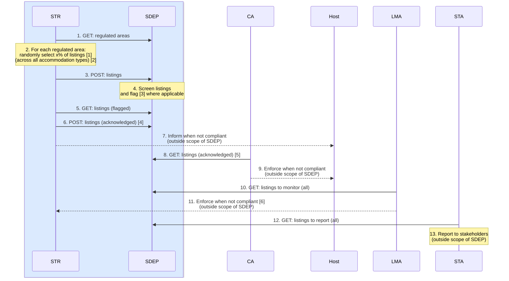
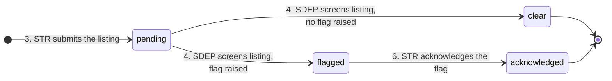

<h1>Listings</h1>

This document provides an overview of SDEP listings, including **random checks**.

Status: work in progress (1.7.0).

- The [Technical Working Group](#technical-working-group) section tracks the open questions

Reference links:

- [Listing (technical)](./LISTING_TECH.md)

<h2>Table of contents</h2>

- [Goal](#goal)
- [Sequence](#sequence)
- [Data](#data)
- [Process](#process)
  - [States](#states)
  - [TravelTech](#traveltech)
  - [Technical Working Group](#technical-working-group)

## Goal

To support short-term rental **listing regulation**.

## Sequence

---

Legend:

- **STR** - Short-Term Rental Platform
- **SDEP** - Single Digital Entry Point
- **CA** - Competent Authority
- **Host** - Short-Term Rental [Host](./HOST_FUNC.md)
- **LMA** - Listing Monitoring Authority
- **STA** - Statistics Authority
- Blue is EU-harmonized, the rest is country-specific
- All actions happen periodically/asynchronously

Footnotes:

- 2.[1] x% of listings = listings with addresses located within the regulated area (and repeat this for each regulated area).
- 2.[2] All accommodation types = short-term rentals, hotels, hostels, ...
- 4.[3] For example: a listing registration number and its address mismatch the corresponding record in a registration system.
- 6.[4] Assume there is no need to further enrich the data (such as agree/dispute/remark).
- 8.[5] These are the acknowledged listings with addresses located within a regulated area for which the CA is responsible.
- 11.[6] For example: when the number of randomly selected listings is insufficient.

---

Endpoints per step (the contract is in [API](./API_TECH.md#surface), the code is in [Listing (technical)](./LISTING_TECH.md)):

| Step | Actor | Endpoint                                                                |
| ---- | ----- | ----------------------------------------------------------------------- |
| 1.   | STR   | `GET /areas`                                                            |
| 3.   | STR   | `POST /listings/bulk`                                                   |
| 4.   | LSA   | `GET /listings`, `GET /listings/count`, `POST /listing-screenings/bulk` |
| 5.   | STR   | `GET /listings`, `GET /listings/count`                                  |
| 6.   | STR   | `POST /listing-acknowledgements/bulk`                                   |
| 8.   | CA    | `GET /listings`, `GET /listings/count`                                  |
| 10.  | LMA   | `GET /listings`, `GET /listings/count`                                  |
| 12.  | STA   | `GET /listings`, `GET /listings/count`                                  |

Steps 2, 7, 9, 11 and 13 have no endpoint: they happen at the actor, outside SDEP.

Process implementations for compliance, monitoring, and reporting are also outside the scope of SDEP.

## Data

See:

- [External API](https://sdep.gov.nl/api/docs)
- [Internal data model](./DATAMODEL_TECH.md)

## Process

### States

---

Legend:

- `pending` - submitted by the platform, awaiting screening
- `clear` - screened, no flags raised
- `flagged` - screened, [flag code(s)](./LISTING_TECH.md#listingresponse) raised, not yet acknowledged
- `acknowledged` - the platform confirmed receipt of the flag (= **random check performed**)

Remarks:

- Every transition creates a new [version](./DATAMODEL_TECH.md#listing) of the listing; a listing row is never updated in place.
- A correction is a new version **in the same state** (same concept as for activities), and is only allowed for the actor that owns that state's write. The lifecycle never restarts:
  - `pending`: the platform may correct the listing data (resubmission with the same `listingId`)
  - `clear`, `flagged`: SDEP may correct the screening (resubmission of the screening result); the state follows the new flag(s)
  - `acknowledged`: final, no corrections (the acknowledgement carries no data, SDEP cannot undo it)
- A platform that (still) wants an already screened listing (`clear`, `flagged`, `acknowledged`) corrected, submits it under a new (or empty > new) `listingId` (this just becomes a new random check in a separate lifecycle)
- Flags raised in the `flagged` state are retained after acknowledgement, so `acknowledged` does not erase the screening outcome.
- The correction edges (`pending --> pending` for the platform, `clear|flagged --> clear|flagged` for SDEP) are left out of the diagram for readability.

---

### TravelTech

The EU Traveltech position paper (available on request) matches the above design:

| EU Traveltech position paper                                  | Design                                                                                          |
| ------------------------------------------------------------- | ----------------------------------------------------------------------------------------------- |
| Random checks: inform authorities and host **[1]**            | OK, see [actions 6,7,8](#sequence)                                                              |
| Article 13(1)(a): list of areas with a registration **[2]**   | OK, see [Areas](./AREA_FUNC.md)                                                                 |
| Article 10(3)(b): machine-readable interface **[3]**          | OK, this is the SDEP API                                                                        |
| Article 7(1)(c): the registration number is the check **[4]** | OK, see [action 3](#sequence) and the [Listing](./LISTING_TECH.md#listingrequest) datastructure |

Quoted from the position paper:

[1] *Where random checks reveal incorrect host declarations on the existence or not of a registration procedure, misuse of a registration number, or invalid registration numbers, platforms must inform both the competent authorities and the host concerned without undue delay.*

[2] *Article 13(1)(a) requires Member States to draw up, make available through the SDEP, and regularly update, the list of areas where a registration procedure applies.*

[3] *Article 10(3)(b) further requires the SDEP to provide ‘a freely accessible and machine-readable online database or online interface’ for those checks*

[4] *In our view, Article 7(1)(c) focuses solely on verifying the validity of the registration number itself. In practice, this means that the **registration number is the data point** used by platforms to perform the check, by submitting it through the functionalities made available via the SDEP and receiving confirmation as to its validity.*

---

### Technical Working Group

To be discussed:

| Context                                                           | Issue                                                       | Proposal                                              | Verdict |
| ----------------------------------------------------------------- | ----------------------------------------------------------- | ----------------------------------------------------- | ------- |
| GitHub issues                                                     | **[4]**                                                     |                                                       |         |
| Address screening                                                 | How to match a listing address within a registration system | Literal, not fuzzy (but do match case-insensitively?) |         |
| A listing is selected and flagged again in a subsequent screening | The host gets double notified, how to manage this           | This is a CA responsibility                           |         |
| Platform acknowledges flagged listing and wants to inform host    | Do we want to insert an extra CA-acknowledgement?           |                                                       |         |

[4] https://github.com/SEMICeu/sdep/issues

| Issue#                                          | Description                                 | Proposal                                         |
| ----------------------------------------------- | ------------------------------------------- | ------------------------------------------------ |
| [67](https://github.com/SEMICeu/sdep/issues/67) | CA request for additional information       |                                                  |
| [70](https://github.com/SEMICeu/sdep/issues/70) | License numbers OR self-declared exemptions |                                                  |
| [72](https://github.com/SEMICeu/sdep/issues/72) | Include address in POST listing             | DO (address is mandatory when posting a listing) |
| [96](https://github.com/SEMICeu/sdep/issues/96) | Filters                                     |                                                  |
| [97](https://github.com/SEMICeu/sdep/issues/97) | Areas                                       |                                                  |
